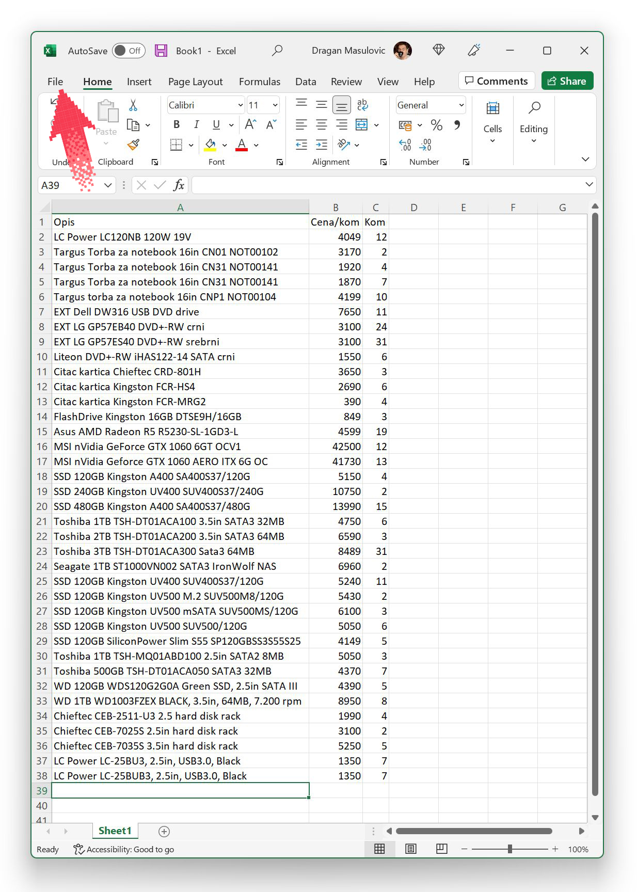

Покретање, навигација и уношење података у табелу
===========================================================

Када се покрене, Ексел нам нуди могућност да направимо нови документ (1),
или да потражимо документ међу фајловима који су на рачунару (2),
или да учитамо неки од докумената на којима смо недавно радили (3):

Ако се одлучимо да кренемо од празног документа (*Blank Workbook*), отвориће се нови празан радни лист:

Одмах испод заглавља прозора налази се *командна трака* (енг. *command ribbon* или кратко само *ribbon*) на којој су сличицама (које се зову *иконе* или *иконице*) приказане разне акције које Ексел уме да изврши. О некима од њих ћемо детаљно причати касније.
Највећи део прозора представља табела чије су колоне означене словима (A, B, C, D, ...), а врсте бројевима (1, 2, 3, ...). Табела се састоји од „кућица“ које зовемо *ћелије*. Ћелија може да садржи

- неки текст (опис),
- неки број, или
- *формулу*, што је главна снага Ексела.

.. infonote::

    Име сваке ћелије се састоји од слова (колоне у којој се налази) и броја (врсте у којој се налази). Дакле, као у шаху!

Ћелија око које се налази зелени оквир се зове *активна ћелија*. Активна ћелија је ћелија у коју можемо да унесемо неки садржај.

.. Погледајмо кратак видео:

   .. ytpopup:: GmQeSPrvMnQ
      :width: 735
      :height: 415

Да бисмо унели неки податак, рецимо, у ћелију Е12, треба да кликнемо мишем на њу или да се стрелицама „дошетамо“ до ње.
Онда можемо да унесемо неки текст или број, рецимо овако:

.. infonote::

    Након уноса податка обавезно треба притиснути тастер [ENTER].

.. Следећи видео илуструје унос података у Ексел табелу:

   .. ytpopup:: Rivrb_UfOMA
      :width: 735
      :height: 415

.. infonote::

    **ПАЖЊА!** У зависности од тога како су у оперативном систему постављена регионална подешавања (*Reginal Settings*) Ексел приказује бројеве користећи децималну тачку (по англо-саксонском стандарду) или користећи децимални зарез (по централноевропском стандарду, који је усвојила и Србија).

**У овом курсу ћемо користити англо-саксонски стандард јер је то стање ствари у програмирању на свим континентима и у свим државама света!**

Пример
""""""

Сада ћемо направити нови празан документ и у њега унети табелу са почетка (стање у складишту рачунарске опреме).

.. infonote::

   Не мораш да прекуцаваш податке. Уместо тога унеси неке своје податке, али води рачуна да табела треба да има три колоне које се зову
   „Opis“, „Cena/kom“ и „Kom“, и да мора да има барем 4-5 редова. *Немој претеривати! Ми смо се одлучили за дужу табелу да
   би пример био убедљивији. За вежбу на часу довољно ће бити да у табелу унесеш 4-5 редова.*

Крени од празне табеле:

Ексел аутоматски додели неку „стандардну“ ширину колонама и висину врстама табеле. Ако ништа не променимо, унос података ће бити непријатан и табела ће на крају изгледати некако овако:

Пошто су колоне сувише уске, описи се не виде добро. Колоне се могу проширити тако што мишем „ухватиш“
границу између два слова у заглављу табеле и развучеш колону колико ти одговара:

Друга могућност је да миша позиционираш на границу између две колоне и када промени облик у :math:`\leftarrow\!\!|\!\!\rightarrow`
урадиш двоклик. Тада ће Ексел сам проценити колико треба проширити колону лево од границе да би садржај у њој био видљив.

У сваком случају, добијамо табелу која је много прегледнија:

На исти начин се могу проширити и врсте у табели, али то нам у овом примеру није било потребно.

Да нам труд не пропадне треба да снимимо табелу коју смо направили. Кликни на „File“:

па онда на „Save as“ (1) и „This PC“ (2):

У одговарајуће поље унеси име фајла (3) и кликни на „Save“ (4):

.. Погледајмо и кратак видео:

   .. ytpopup:: ono-ZxBnTiU
      :width: 735
      :height: 415
      :align: center

