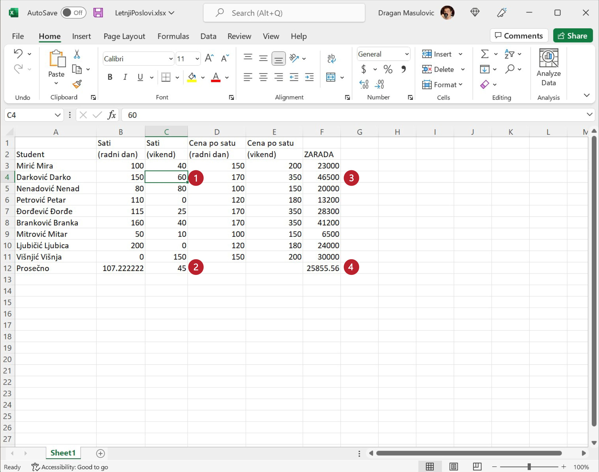
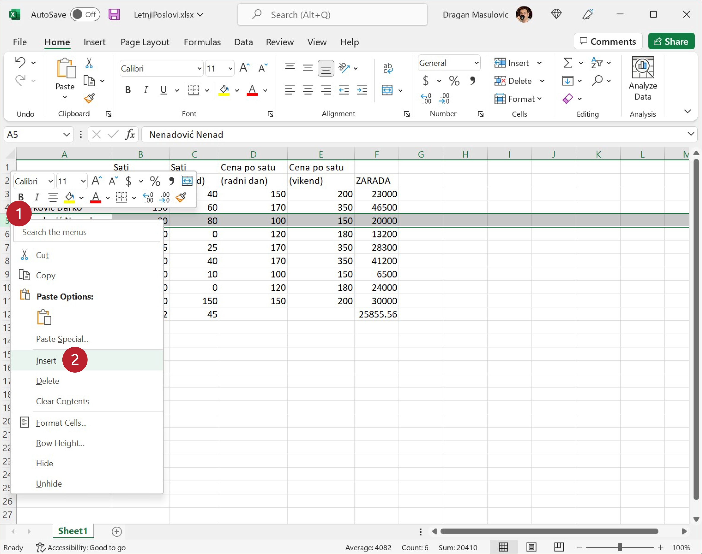
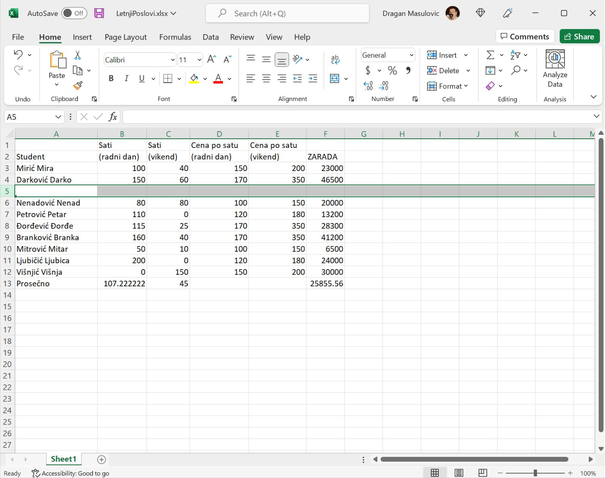
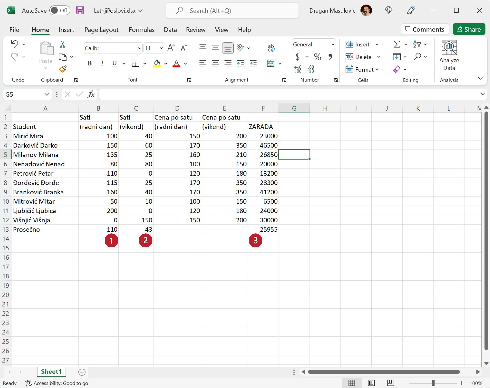
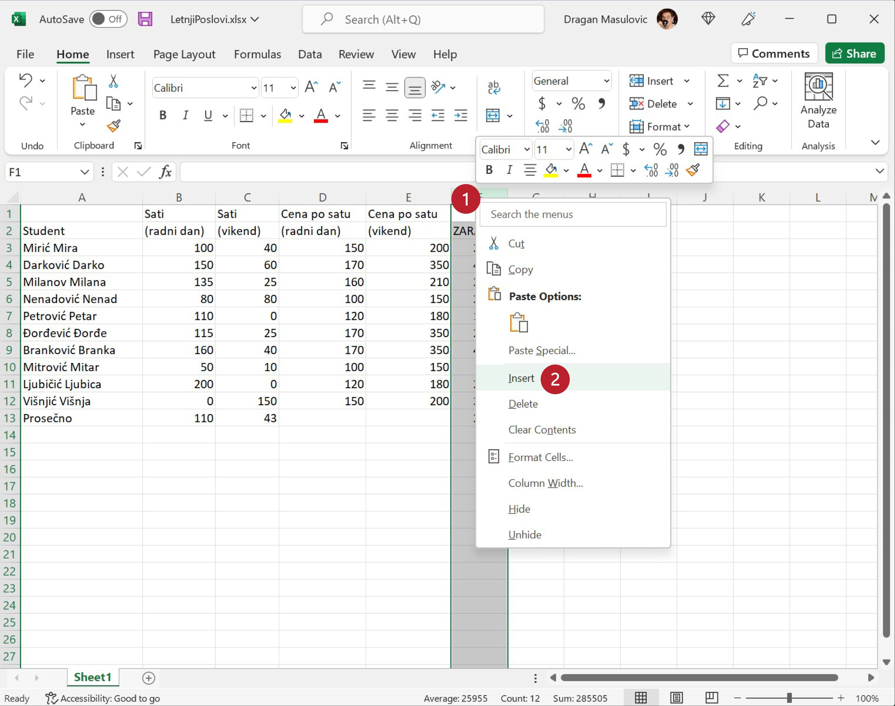
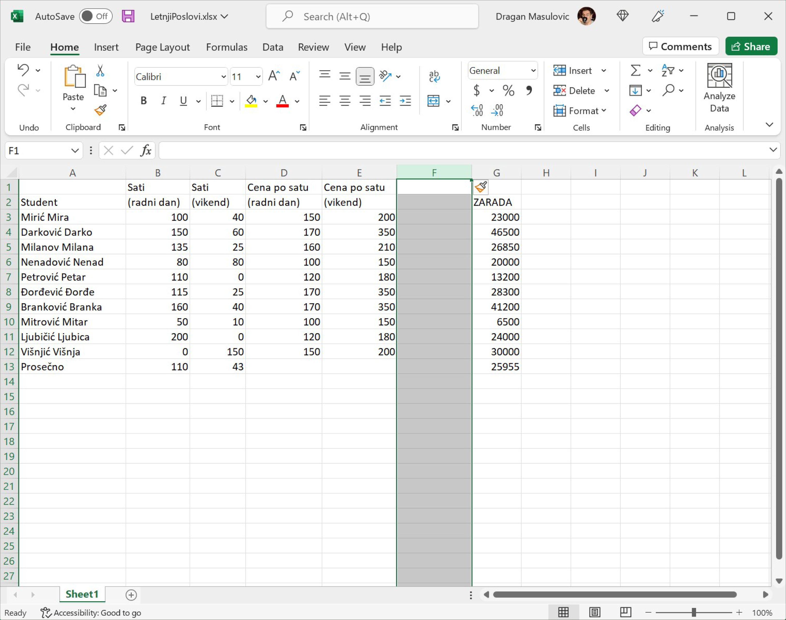
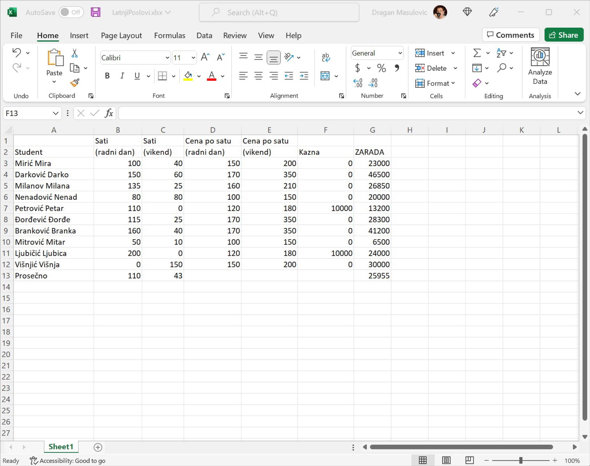
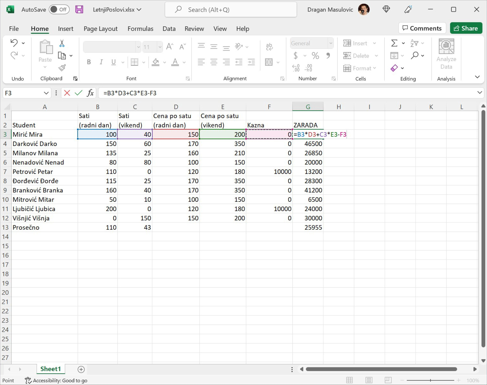
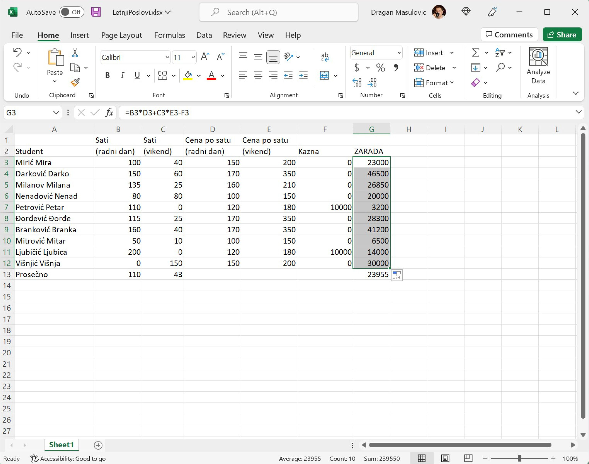

Аутоматска рекалкулација и додавање врста и колона табели
================================================================

Највећа снага Ексела је у томе што можемо да се играмо са подацима, а рачунање ће машина урадити за нас!

.. infonote::

    *То је и циљ модерног рачунарства: све досадне послове треба препустити машини, што ће нама, људима,
    олакшати да испољавамо своју креативност!*

Корак 6.
------------------

Сада се мало играј бројевима. Промени неке вредности и примети како Ексел аутоматски прерачунава све ћелије чија вредност зависи од начињене измене.

Корак 7.
-----------------------

Администрација Студентске задруге је заборавила да у табелу унесе једног студента. Уметнућемо врсту између Дарка и Ненада и њу попунити подацима о том студенту.

Десним кликом кликни на редни број врсте 5 (баш на број 5) и у малом менију који се појавио одабери „Insert“:

Појавиће се нова празна врста:

Унеси неко име и неке податке о радним сатима и накнадама, као и формулу за обрачун зараде,
и уочи да је *Ексел аутоматски прерачунао све податке у табели*:

.. Погледајмо и кратак видео:

   .. ytpopup:: afVGgOiqlf4
      :width: 735
      :height: 415
      :align: center

Корак 8.
-----------------

Администрацији Студентске задруге је потом јављено да неки студенти нису испоштовали уговор са фирмом код које су радили преко лета и да због тога треба да буду кажњени (новчано). Зато ћемо уметнути нову колону између колона E и F и у њу унети податке о казнама.

Десним кликом кликни на име колоне F (баш на слово F) и у малом менију који се појавио одабери „Insert“:

Појавиће се нова празна колона:

У ћелију F2 упиши „Kazna“ и попуни остале ћелије колоне F (ако студент није кажњен упиши 0), рецимо овако:

.. Следећи видео демонстрира уметање врсте и колоне у табелу:

   .. ytpopup:: 9CI5HS9O7_k
      :width: 735
      :height: 415
      :align: center

Овај пут Ексел није ништа прерачунао аутоматски: вредности зараде се нису измениле! Разлог је то што Ексел не зна како да укључи нове податке у обрачун зараде -- *за то нам је потребна нова формула!* Зато ћемо сада у ћелију G3 унети формулу која узима и казну у обзир:
::

    = B3*D3 + C3*E3 - F3

и онда ћемо брзим копирањем ту формулу „развући“ на ћелије G3:G12

.. infonote::

    У ситуацијама које су јасне *Ексел ће аутоматски да прерачуна све податке у табели*, али Ексел нема начина да схвати шта се дешава ако се мења формула по којој се врши обрачун. У том случају морамо ручно променити формуле.

