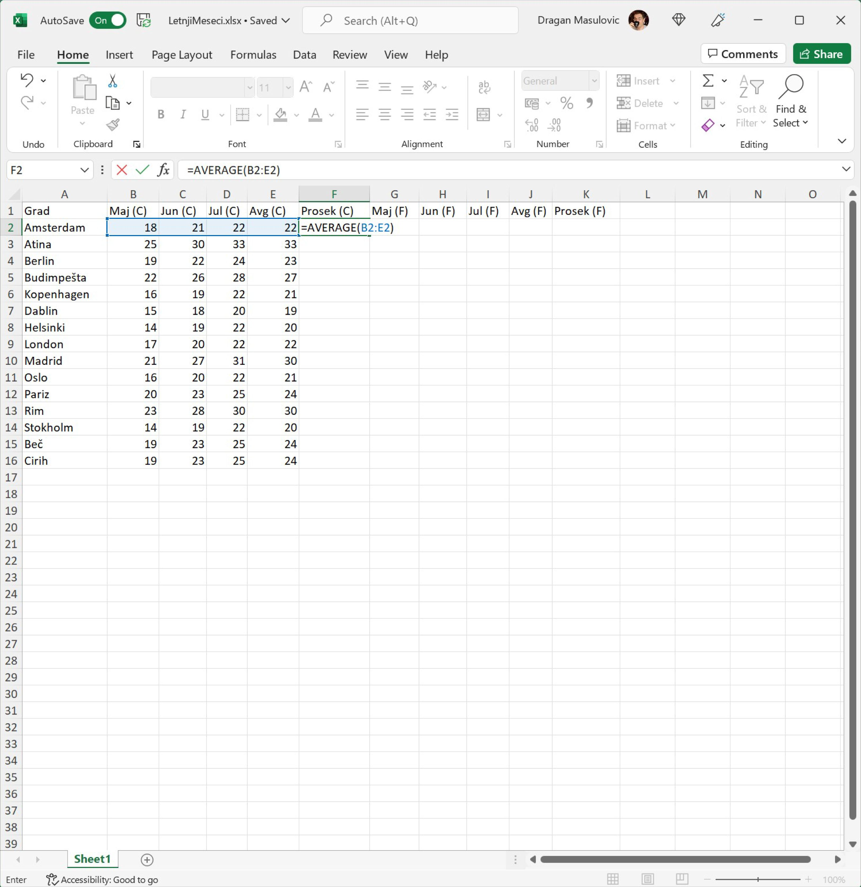
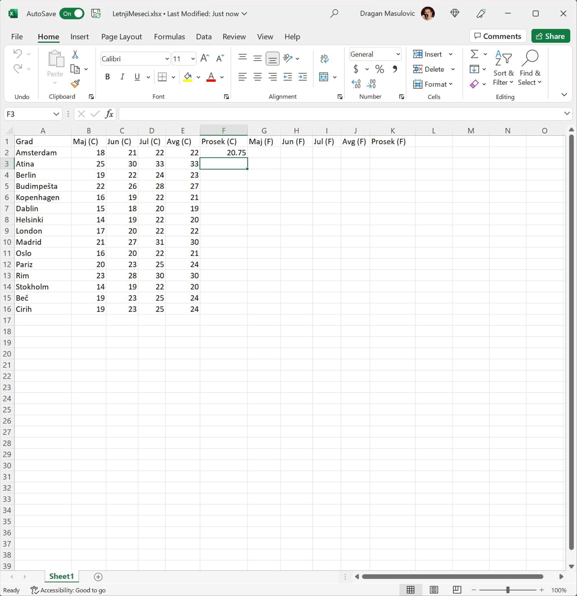
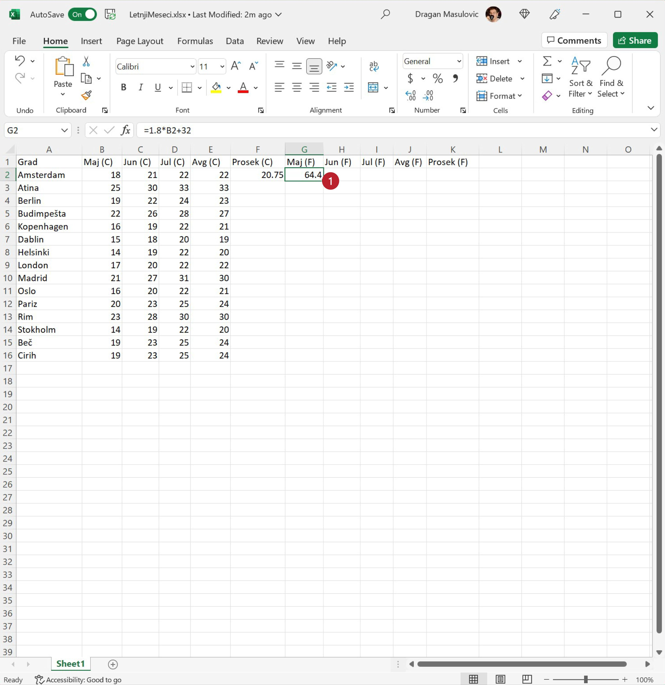
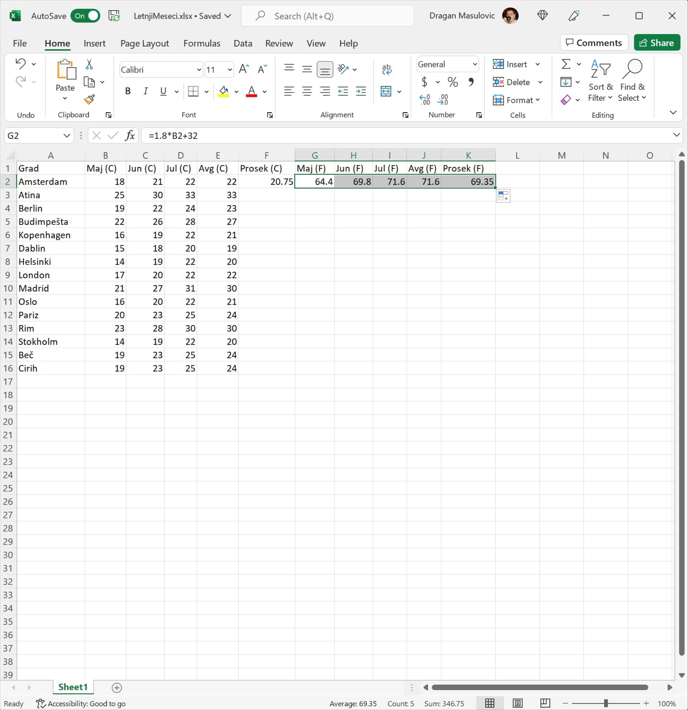
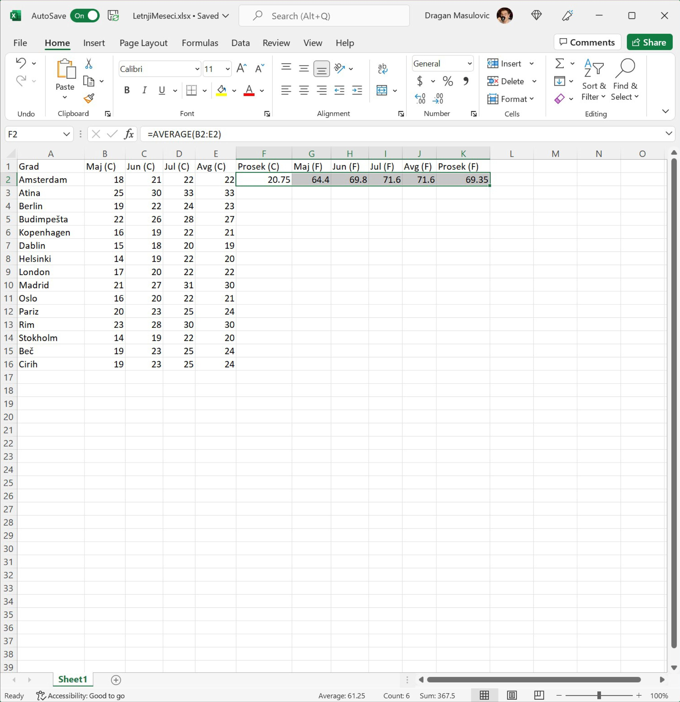
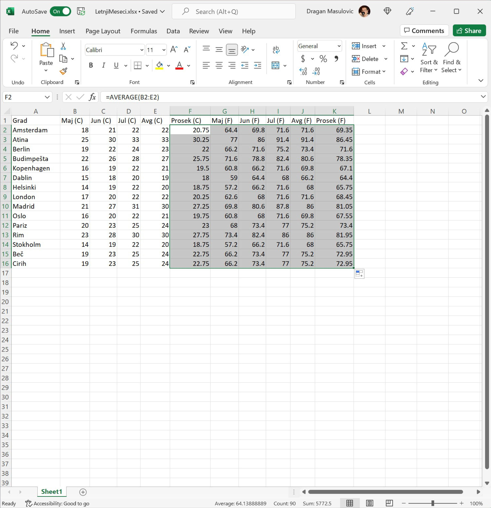
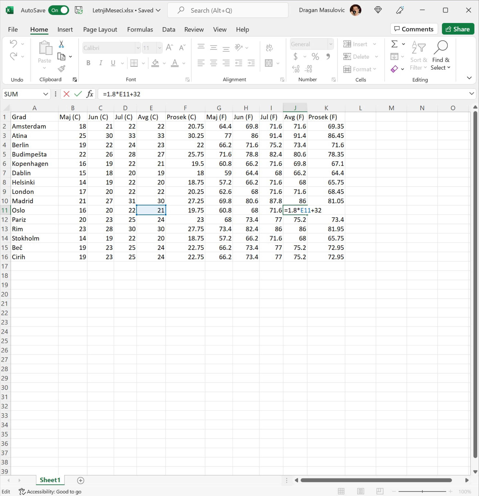

Селектовање групе ћелија
====================================

У табели (коју ћеш преузети у Кораку 1) дате су очекиване температуре у степенима Целзијуса у неким европским градовима у мају, јуну, јулу и августу једне
године. Прерачунаћемо те податке у степене Фаренхајта, за сваки град одредити просек за четири наведена месеца,
и одредићемо најтоплије и најхладније градове по месецима.

Корак 1.
-----------------------

Преузми табелу са следећег линка `LetnjiMeseci.xlsx <https://petljamediastorage.blob.core.windows.net/root/Media/Default/Kursevi/programiranje_II/epodaci/LetnjiMeseci.xlsx>`_.

Корак 2.
----------------

У ћелију F2 унеси формулу
::

    =AVERAGE(B2:E2)

која ће израчунати просечну температуру за ова четири месеца у Амстердаму:

и притисни [ENTER]:

Корак 3.
--------------------

Сада ћемо у ћелију G2 да унесемо формулу која ће прерачунати температуру у мају у Амстердаму из степена Целзијуса у степене Фаренхајта по формули

.. math::
     t_F = 1,8 \cdot t_C + 32

Приликом уношења формуле морамо повести рачуна о томе да се множење означава звездицом ``*``:

.. image:: ../../_images/DataTypes4.jpg
   :width: 600px
   :align: center

Корак 4.
--------------------

Исти посао треба урадити за јун, јул, август и за просек. Можемо исту формулу унети још четири пута, али је боље да се послужимо брзим копирањем. Ако кликнемо на ћелију G2 видећемо увек присутну „бубуљицу“ у доњем десном углу:

Ухватимо „бубуљицу“, развучемо до краја врсте и добијамо:

Формула у ћелији G2 је гласила
::

   = 1.8 * B2 + 32

Ако погледамо шта пише у ћелији H2, видећемо да тамо стоји формула
::

   = 1.8 * C2 + 32

Као и раније, на основу формуле која је била уписана у ћелију G2 Ексел је простим алгоритмом генерисао формуле и уписао их редом у све ћелије кроз које смо „развукли оквир“. Међутим, пошто смо овај пут „оквир развукли“ хоризонтално Ексел је применио други алгоритам: сада се слова у адреси ћелије редом повећавају, а бројеви у адреси ћелије се не мењају. Ево и табеларног прегледа:

.. csv-table:: Формуле у одговарајућим ћелијама табеле
   :header: "Ћелија", "Формула"
   :align: left

   "G2", "= 1.8 * B2 + 32"
   "H2", "= 1.8 * C2 + 32"
   "I2", "= 1.8 * D2 + 32"
   "J2", "= 1.8 * E2 + 32"
   "K2", "= 1.8 * F2 + 32"

.. infonote::

    Брзо копирање ради и када оквир „развлачимо“ вертикално, и када га „развлачимо“ хоризонтално.
    Поента је да се у сваком случају „чува логика формуле“.

До сада смо попунили тек први ред табеле. Уместо да све ове кораке понављамо за сваки ред табеле посебно, послужићемо се још једним лукавством.
Означићемо низ ћелија (ова операција се у жаргону зове „селектовање“, од енг. *select*, што значи „одабрати“) и онда ћемо брзим копирањем попунити све ћелије у табели.

Корак 5.
-----------------

Пошто смо попунили први ред табеле, означићемо (такорећи *селектоваћемо*) низ ћелија F2:K2 тако што ћемо кликнути на ћелију F2 (дакле, НЕ на „бубуљицу“, већ у срце ћелије F2) и *не пуштајући миша* развући оквир до ћелије K2:

Овим смо означили ћелије које су интересантне (јер садрже формуле које желимо да размножимо по целој табели).

Корак 6.
------------------

Е, *сада ухватимо за „бубуљицу“* која се налази у доњем десном углу означеног распона и „развучемо“ до дна табеле:

Ексел је ископирао формуле које су се налазиле у означеним ћелијама и током копирања сваку формулу прилагодио позицији на којој се она налази. На пример, ако погледамо ћелију J11 (температура у степенима Фаренхајта у Ослу у августу) видећемо да је та вредност израчуната тако што је формула за конверзију примењена на ћелију E11 (температура у степенима Целзијуса у Ослу у августу), као што и треба:

Тако је овај део задатка решен.

.. Ево и демонстрације:

   .. ytpopup:: MW_2mlGs1qg
      :width: 735
      :height: 415
      :align: center

