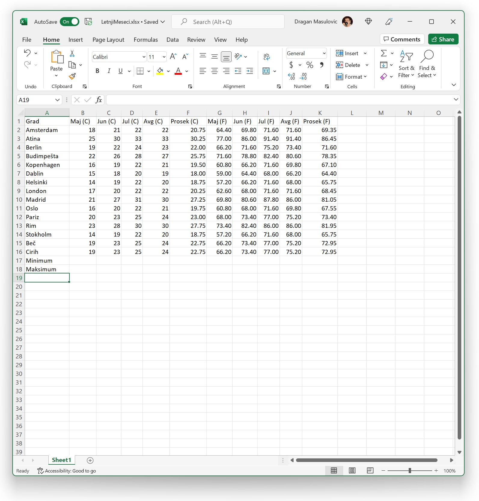
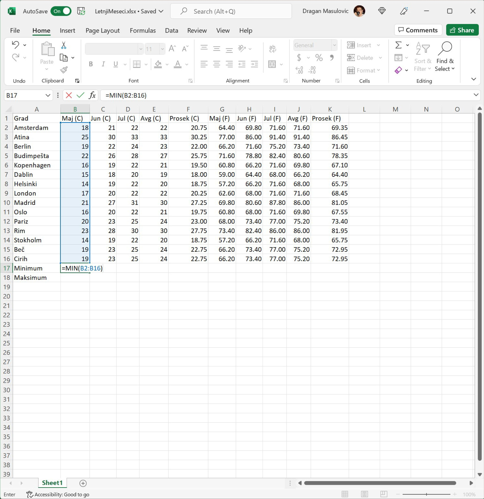
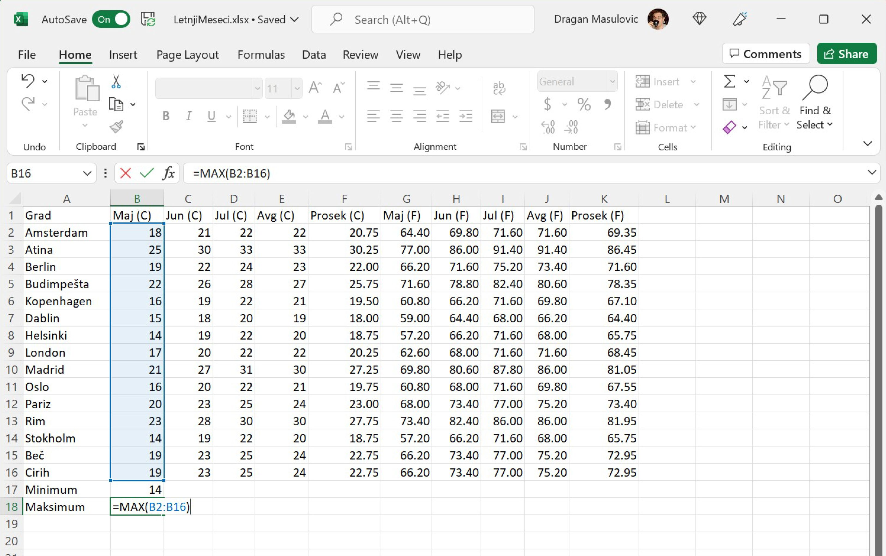
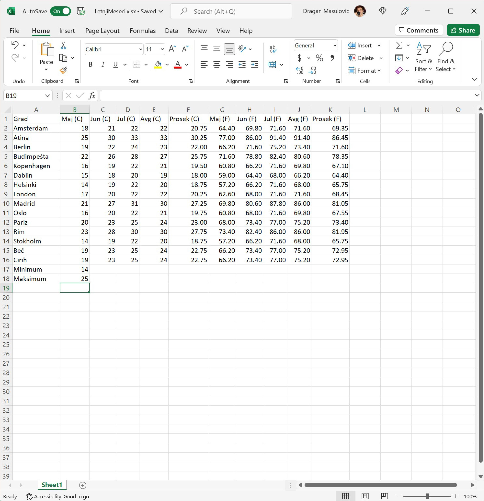
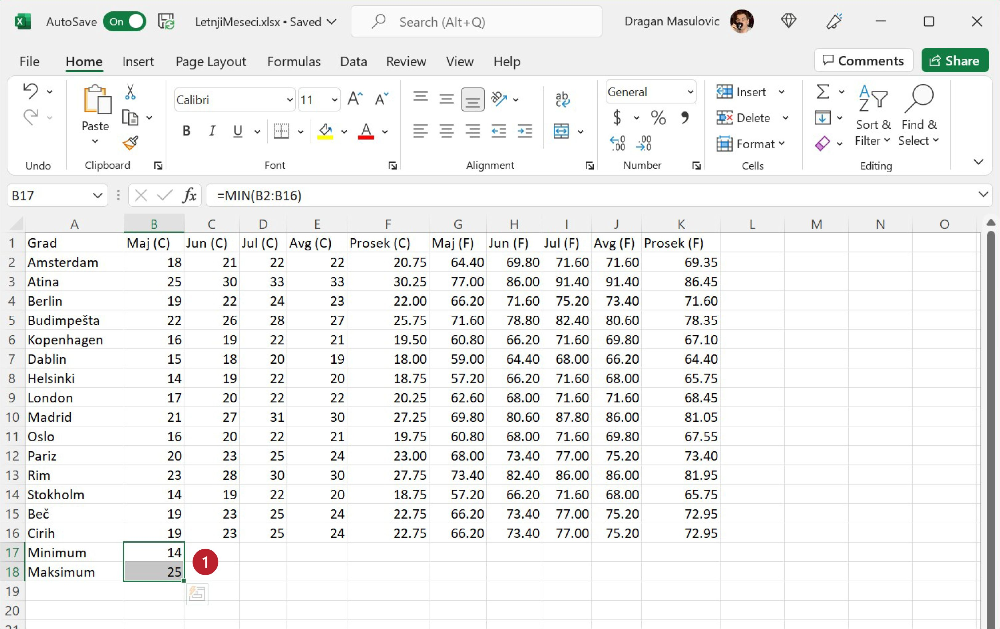
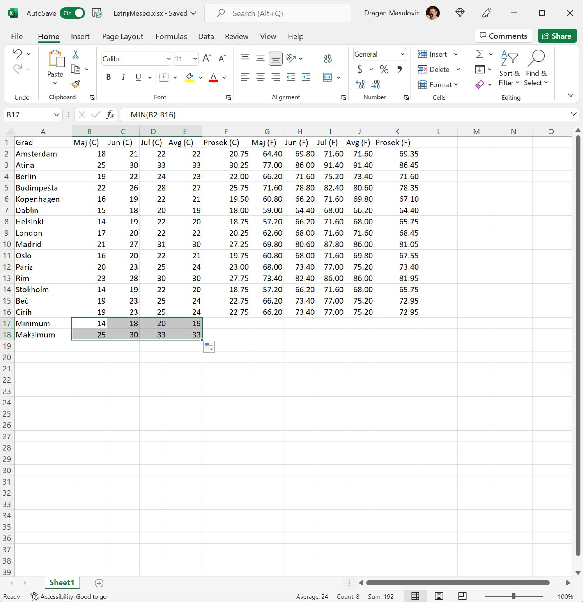
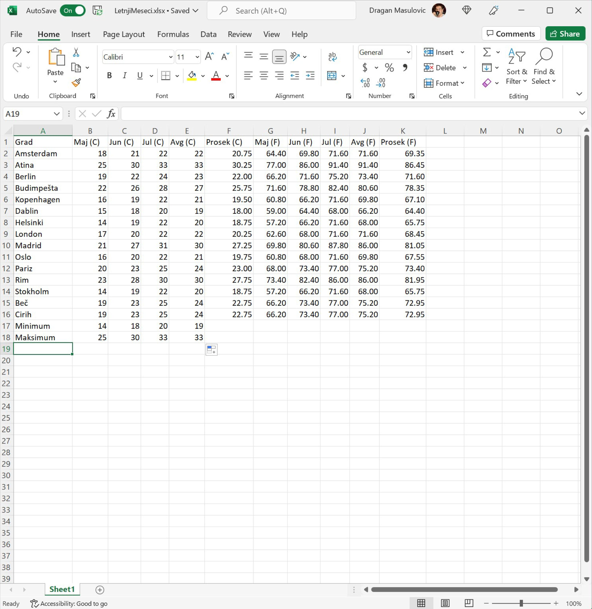

Рачунање минимума и максимума
======================================

Сада ћемо научити како да одредимо најхладнији и најтоплији град по месецима.

Корак 8.
------------------

У ћелију А17 упиши „Minimum“, а у ћелију A18 упиши „Maksimum“:

Корак 9.
--------------------

У ћелију B17 упиши следећу формулу:
::

    = MIN(B2:B16)

Ова формула ће израчунати најмањи (MIN) од бројева B2, B3, ..., B16 (B2:B16) и ту вредност уписати у ћелију B17:

Корак 10.
---------------------

Онда у ћелију B18 упиши формулу:
::

    = MAX(B2:B16)

Ова формула ће израчунати највећи (MAX) од бројева B2, B3, ..., B16 (B2:B16) и ту вредност уписати у ћелију B18:

Тако смо добили најнижу и највишу температуру у мају:

Корак 11.
-------------------------

Да бисмо то исто урадили за јун, јул и август послужићемо се комбинацијом трикова које смо научили -- селектоваћемо ћелије B17 и B18:

па ћемо „ухватити за бубуљицу“ и развући селекцију до колоне Е:

Тако смо добили најниже и највише температуре које су постигнуте у ова четири месеца:

