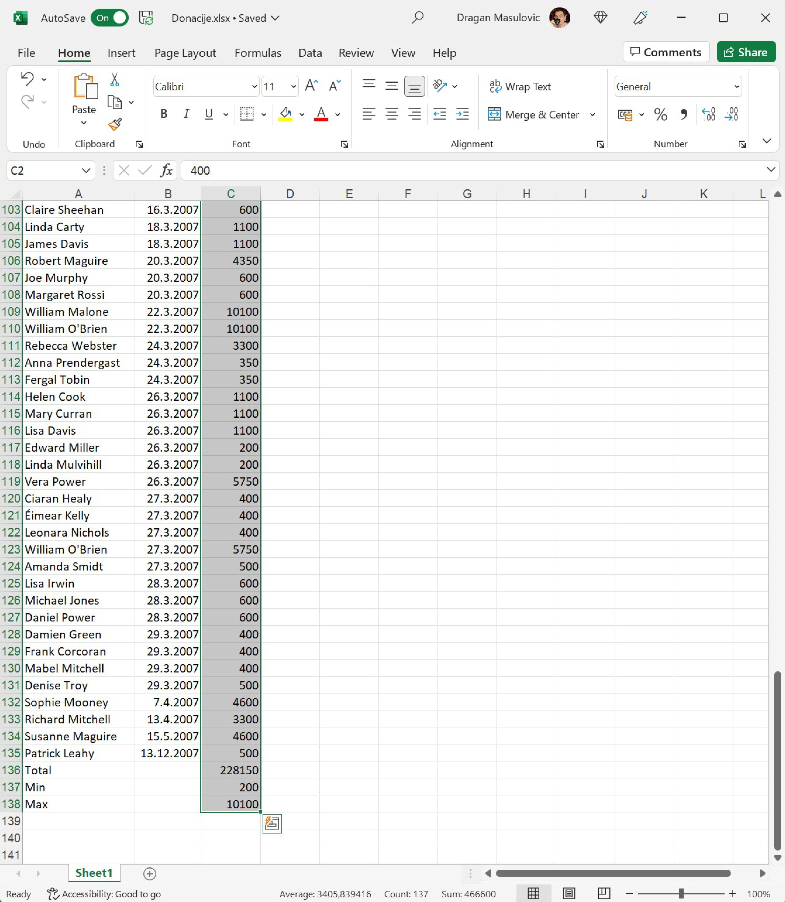

Валуте у Ексел табели
========================================

У овом примеру ћемо показати како се у Ексел табели приказују валуте (као што је евро или амерички долар).

Корак 1.
---------------------------

Са следећег линка `Donacije.xlsx <https://petljamediastorage.blob.core.windows.net/root/Media/Default/Kursevi/informatika_VIII/epodaci/Donacije.xlsx>`_ преузми документ *Donacije.xlsx* и сними га на свој рачунар.

Корак 2.
-----------------

Покрени Ексел и отвори фајл. Видећеш да су у фајлу наведене донације које је једно спортско друштво примило. За сваку донацију је наведено име донатора (у колони „Name“), датум донације (у колони „Date“) и износ (у колони „Amount“):

Корак 3.
----------------------

Корестећи клизач:

спусти се до дна табеле и додај три нове врсте:

* Total
* Min
* Max

Корак 4.
----------------------

У поље C136 унеси формулу
::

    =SUM(C2:C135)

како би добио укупну вредност донација:

.. figure:: ../../_images/DataTypes304.jpg
   :width: 780px
   :align: center
   :class: screenshot-shadow

Потом у поље C137 унеси формулу
::

    =MIN(C2:C135)

а у поље C138 формулу
::

    =MАX(C2:C135)

како би добио вредност најмање и највеће донације:

Корак 5.
------------------

Пошто су све донације биле у еврима, форматираћемо све бројеве у колони C тако да се испред броја појави ознака за евро. Селектуј ћелије C2:C138

Кликни на стрелицу (1) поред ознаке формата ћелије и појавиће се мали мени.
У њему постоји опција „Currency“ (енг. валута, трећа од врха), али ако је одаберемо, Ексел ће износе означити
симболом за амерички долар или наш динар, зависно од регионалних подешавања.
Зато ћемо да одаберемо „More Number Formats...“ (2) како је на слици и предложено:

Добијамо нови дијалог:

У одељку „Category“ (енг. „Категорија“) одаберемо „Currency“ (1).
Ексел нам поново нуди симбол за амерички долар или наш динар.
Да бисмо променили симбол, кликнемо на стрелицу (2) која отвара избор расположивих симбола валута.
Тако добијамо листу у којој потражимо симбол за евро.
За ово треба стрпљења јер симбол за евро уопште није близу врха.
Одаберемо симбол за евро (3) и кликнемо ОК (4).

.. Ево и кратког видеа који илуструје овај поступак:

   .. ytpopup:: -mwmmFrO1so
      :width: 735
      :height: 415
      :align: center

Табела сада изгледа овако:

.. questionnote::

    **Шта је сад? Где су нестали износи у врсти „Total“ И „Max“?**

.. infonote::

        Када у некој ћелији Ексел прикаже
        ::
        
            #############
        
        то значи да се ту налази неки број, али је ћелија сувише уска да би тај број могао да буде приказан у целости. Само треба проширити колону C и све ће бити у реду:

Корак 6.
---------------------

Сними табелу за крај.

