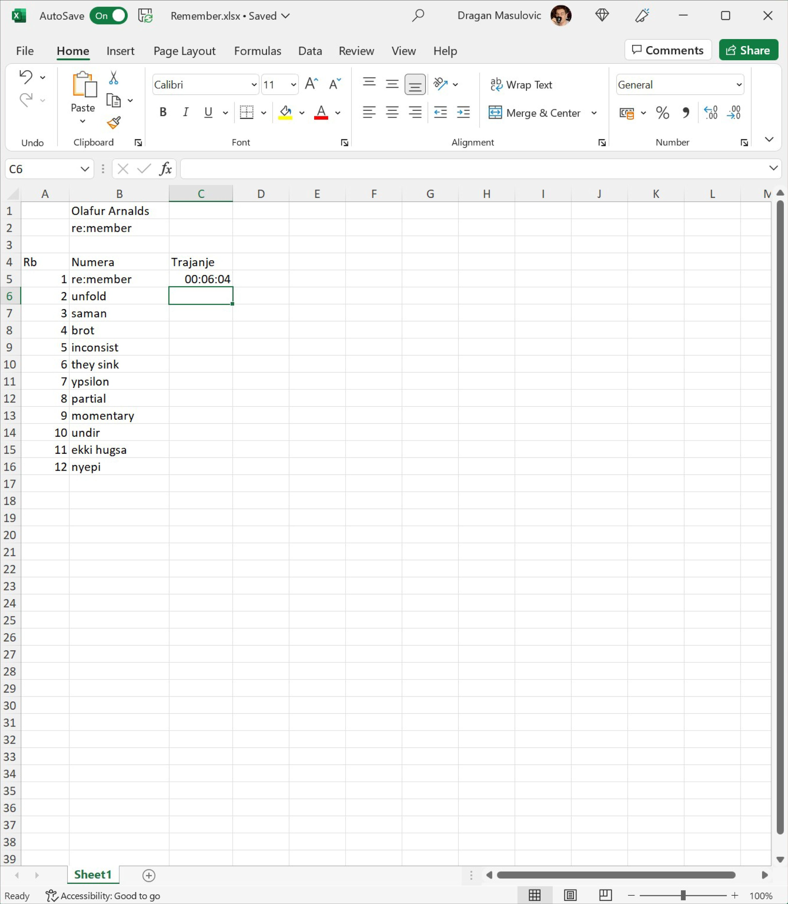
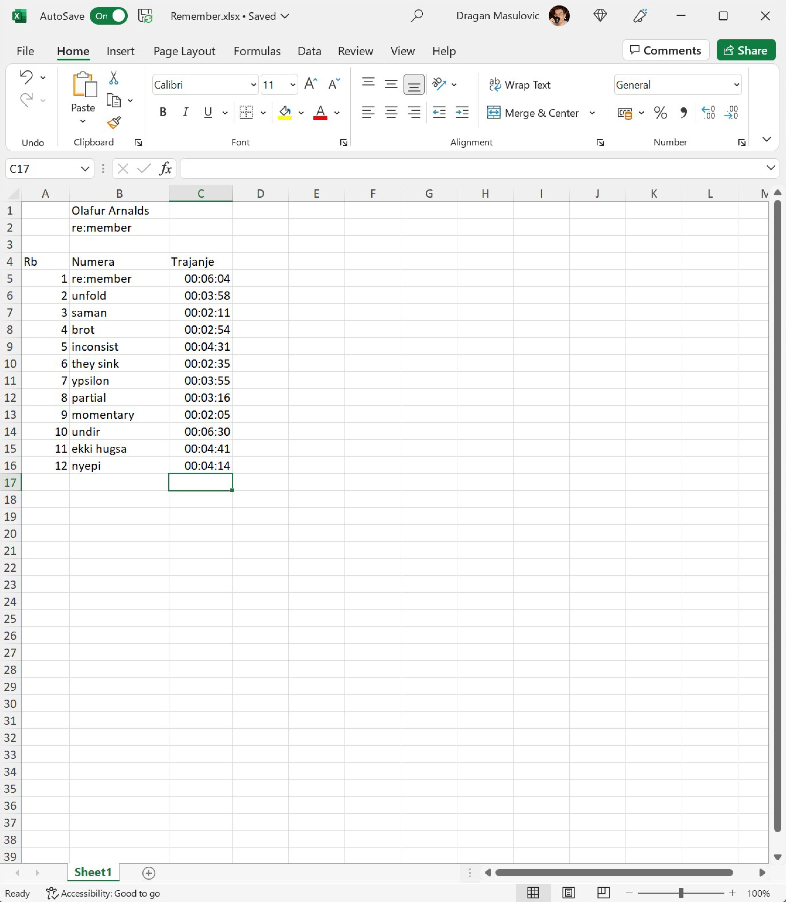
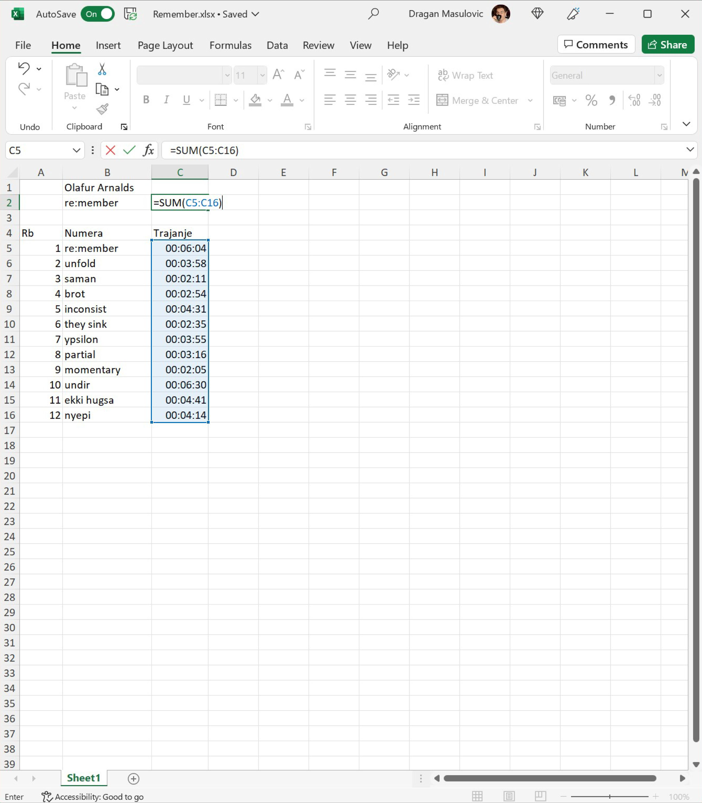
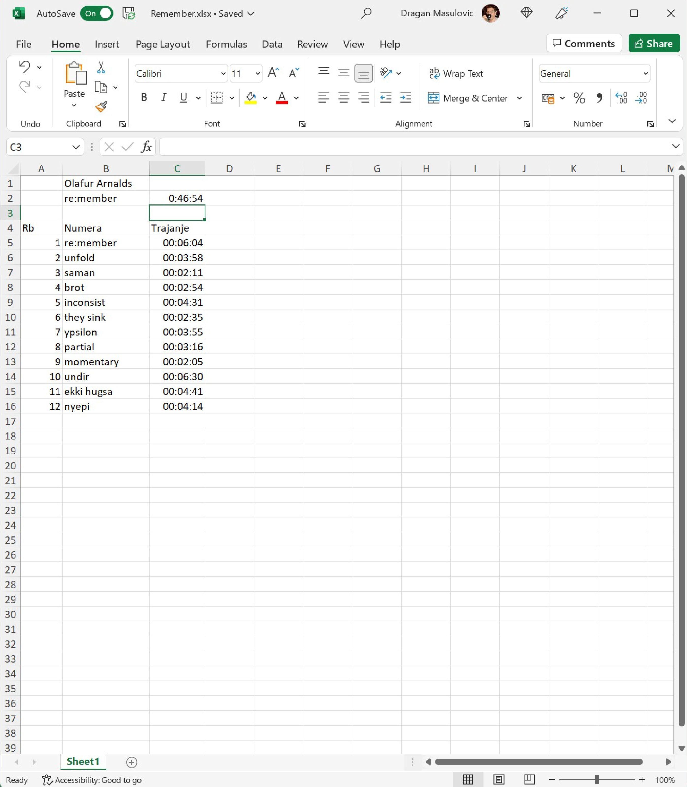
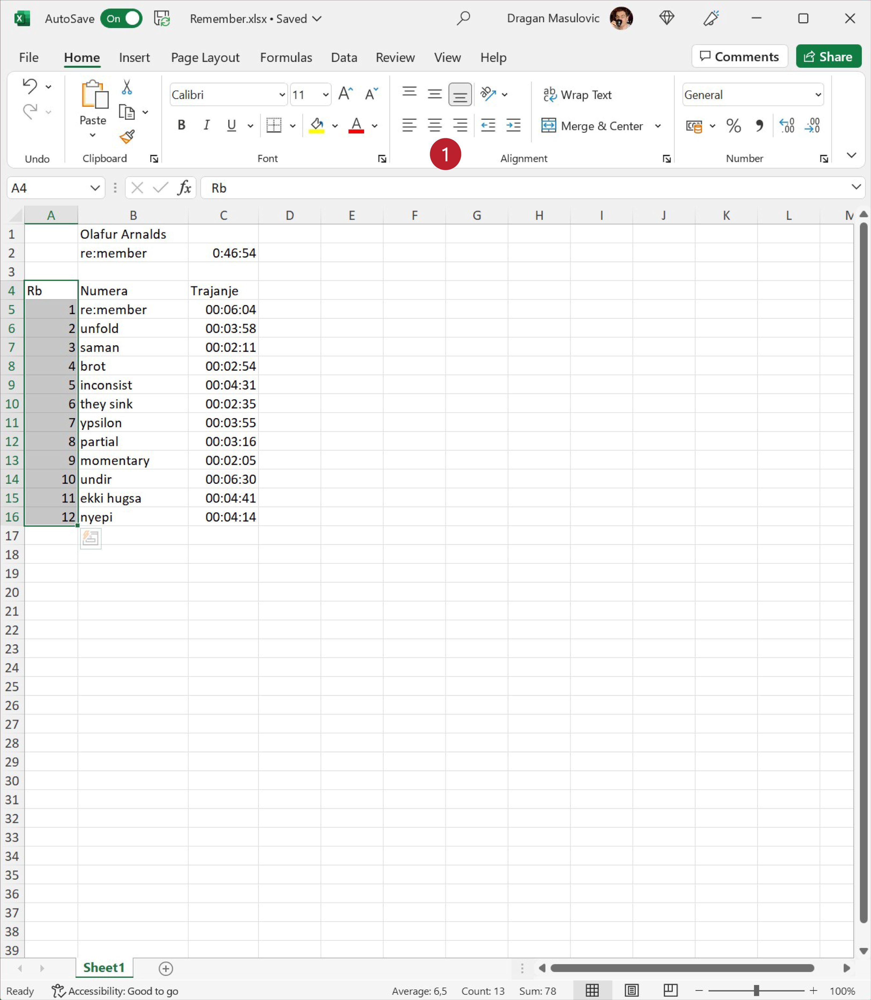
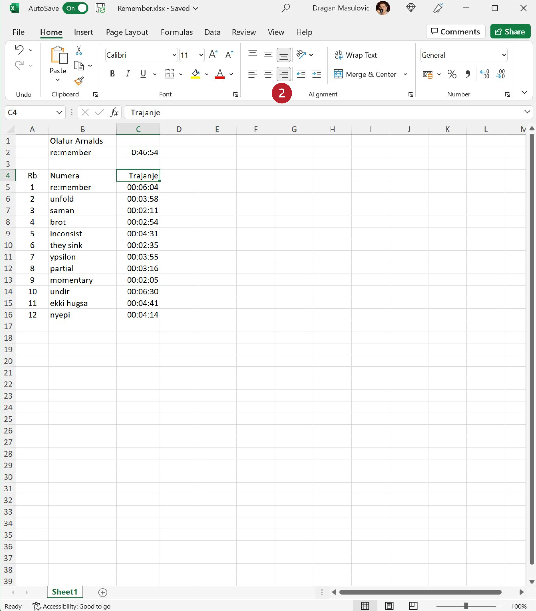
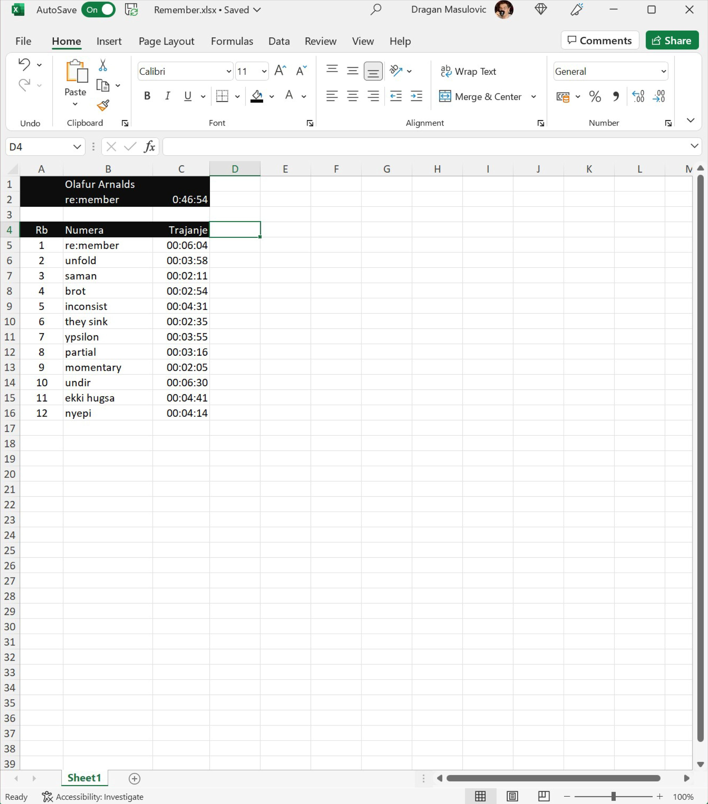
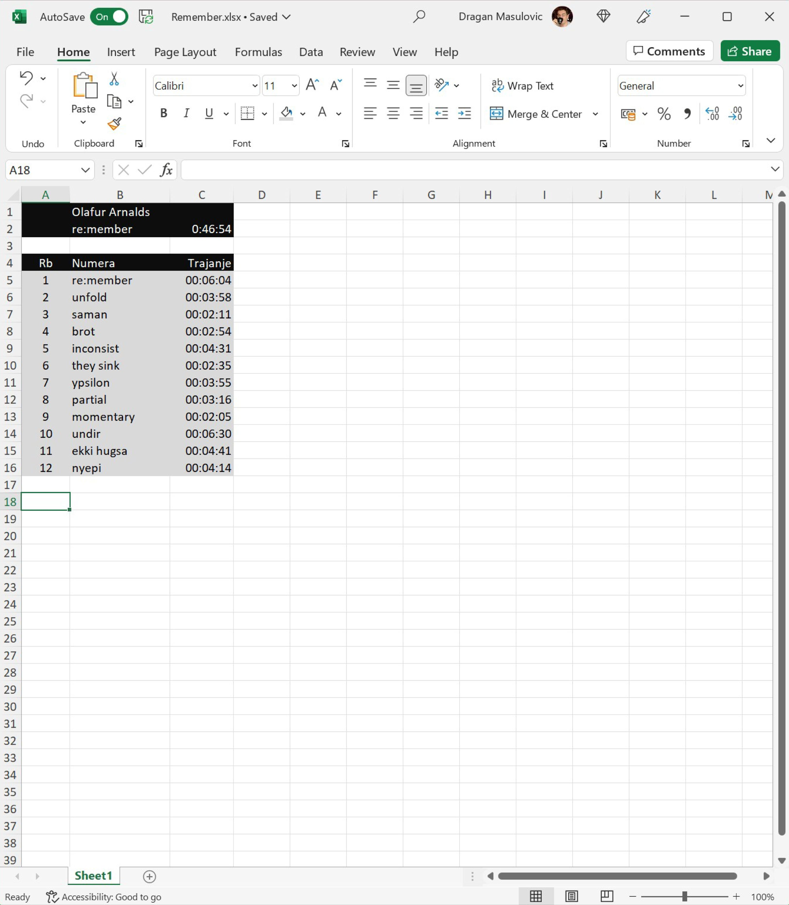

Време у Ексел табели
========================================

Овако изгледа плеј-листа албума „re:member“ популарног исландског музичара Olafurа Arnaldsа:

.. csv-table:: Плеј-листа албума „re:member“ Olafurа Arnaldsа
   :header: "Rb", "Numera", "Trajanje"
   :align: left

   "1", "re:member", "6:04"
   "2", "unfold", "3:58"
   "3", "saman", "2:11"
   "4", "brot", "2:54"
   "5", "inconsist", "4:31"
   "6", "they sink", "2:35"
   "7", "ypsilon", "3:55"
   "8", "partial", "3:16"
   "9", "momentary", "2:05"
   "10", "undir", "6:30"
   "11", "ekki hugsa", "4:41"
   "12", "nyepi", "4:14"

Унећемо ове податке у Ексел и израчунати колико је укупно трајање албума.

Корак 1.
-----------------------

Са следећег линка `Remember.xlsx <https://petljamediastorage.blob.core.windows.net/root/Media/Default/Kursevi/informatika_VIII/epodaci/Remember.xlsx>`_ преузми датотеку која садржи имена нумера,
покрени Ексел и учитај датотеку.

Корак 2.
------------------

За сваку од нумера унеси трајање. Податке који се односе на трајање (време) треба у Ексел да унесемо у облику
::

    hh:mm:ss

где *hh* означава сате, *mm* минуте, а *ss* секунде, раздвојено двотачкама. Увек морамо унети све три компоненте (и сате, и минуте и секунде), чак и ако је неки од њих 0. На пример, за прву нумеру ћемо унети
::

    0:6:4

што значи 0 сати, 6 минута и 4 секунде. Тако добијамо:

Унесимо сада на исти начин и трајање свих осталих нумера:

Ексел уме да рачуна са временима, па је лако одредити укупно трајање албума. У ћелију C2 ћемо уписати укупно трајање албума тако што ћемо унети формулу:
::

    =SUM(C5:C6)

Ексел је сабрао трајање свих нумера и у поље уписао трајање целог албума:

Корак 3.
------------------------

За крај ћемо мало улепшати табелу. Прво ћемо центрирати садржај у ћелијама A4:А16

док ћемо ћелију C4 поравнати по десној ивици:

Позадину ћелија A1:C2 ћемо обојити црно, а слова бело. Исто тако и ћелије A4:C4

Стил слова у ћелији B1 (име аутора) ћемо поставити на *italic*, а у ћелијама B2:C2 (име албума и трајање) на **bold**. Коначно, ћелије A5:C16 ћемо обојити светло сиво:

Корак 4.
---------------------

Сними табелу.

