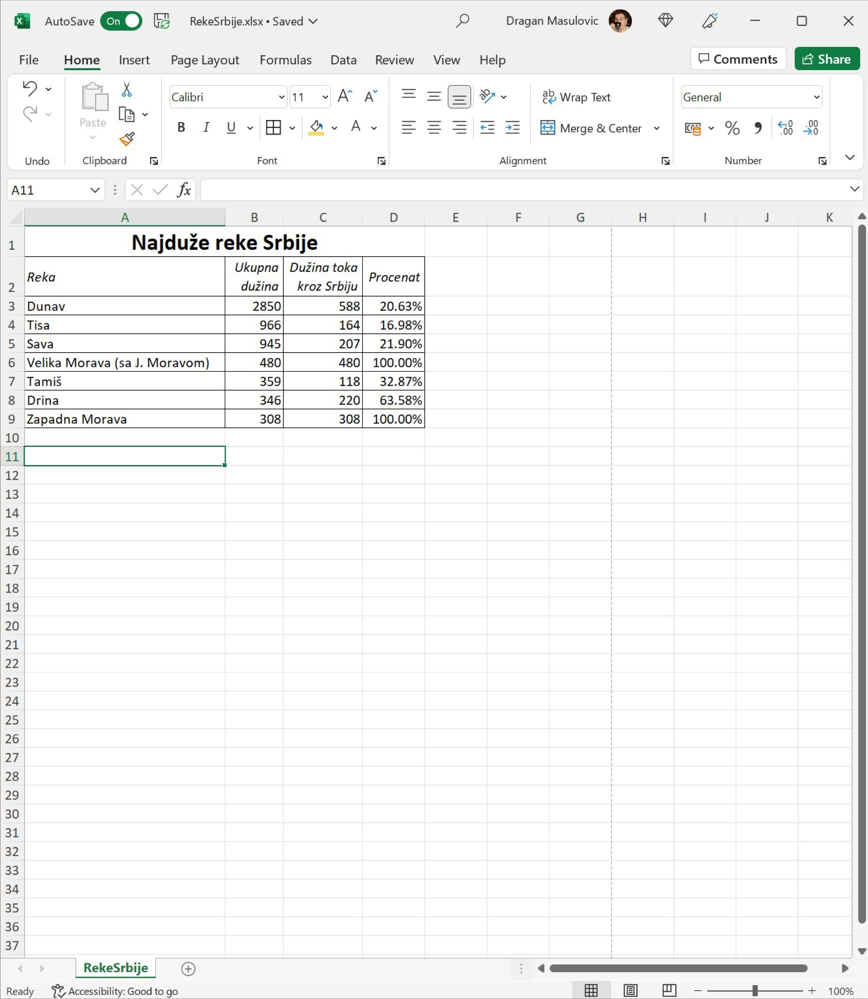
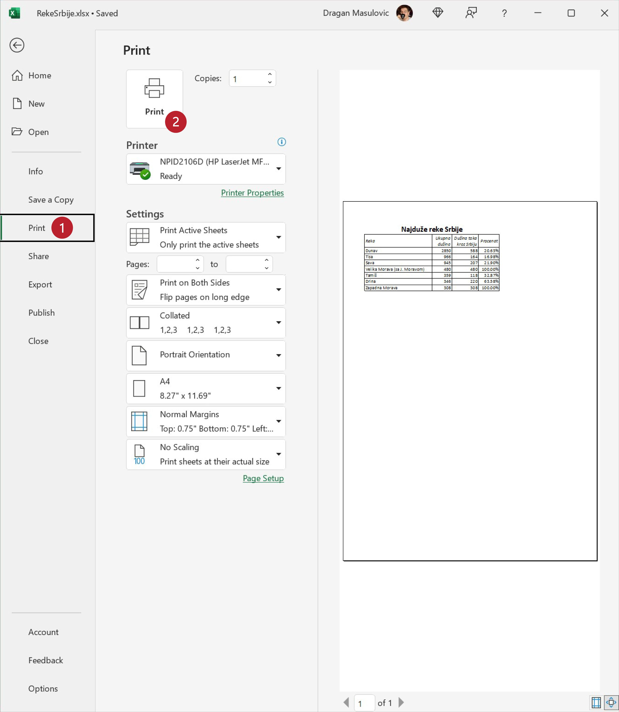
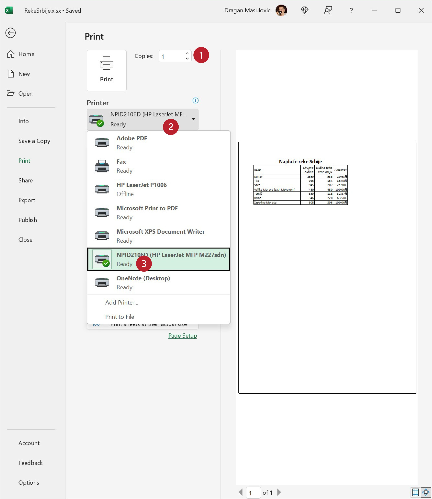
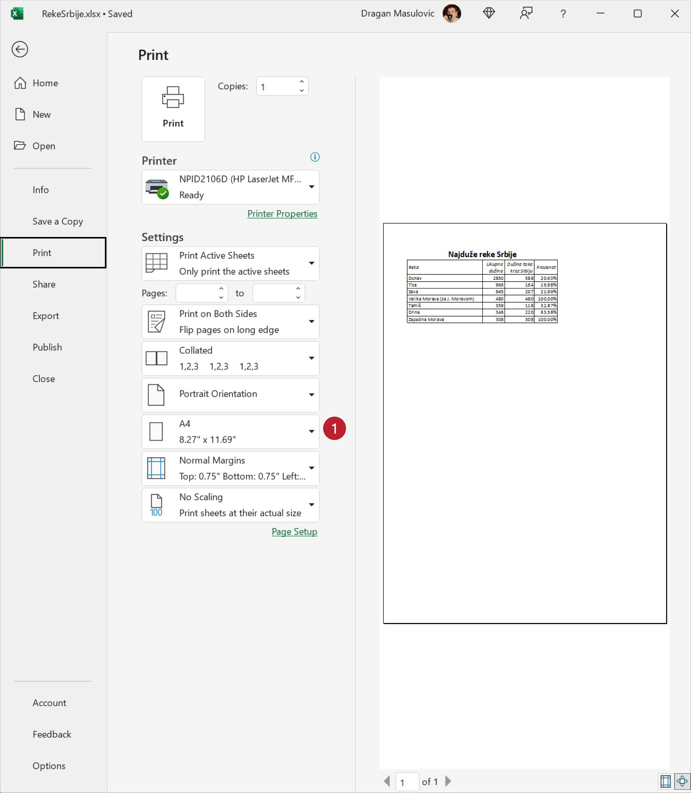

Штампање документа
=============================

Иако живимо у 21. веку, папирни документи и даље представљају незаобилазан сегмент пословне реалности.
Зато сваки програм за уређивање текста, табела итд. има могућност да одштампа документ.
Да бисмо одштампали табелу, треба прво да кликнемо на „File“:

и у новом погледу који смо добили треба да кликнемо на опцију „Print“ (1).
Са десне стране нам је приказан преглед документа:
тако ће документ изгледати када се одштампа. Кликом на дугме „Print“ (2) документ шаљемо на штампу:

Овај документ ће бити одштампан у једном примерку („Copies: 1“) на штампачу који се подразумева.
Лако можемо да променимо број примерака избором броја у кућици (1),
или да документ пошаљемо на други штампач (кликнемо на стрелицу (2) поред имена активног штампача,
па са списка располошивих штампача одаберемо други штампач (3)):

У делу менија који се зове „Settings“ можемо да мењамо разне параметре штампе (маргине, оријентацију папира итд), а ми ћемо детаљно причати само о једном -- параметру који одређује формат папира:

Стандардни формат папира за штампање у Европи, па и у Србији као држави европског културног простора, зове се А4.
Његове димензије су 210 x 297 мм. (Ако те занима зашто се баш тако зове и зашто је баш тих димензија, потражи на Интернету
„формати папира“ или „ДИН А формат“). С друге стране, у Северној Америци, одакле нам долазе сви програми,
стандардни формат за штампање се зове „Letter“ и његове димензије су 8,5" x 11" (што је 215,9 x 279,4 мм). Дакле, формат
„Letter“ је дежмекастији -- мало је „нижи“ и мало шири:

.. figure:: ../../_images/A4-Letter.jpg
   :width: 600px
   :align: center

Често се дешава да су након инсталације софтвера параметри подешени према америчком стандарду.
Уколико је то случај, треба променити формат папира. Довољно је кликнути на стрелицу поред имена формата и одабрати жељени формат.

.. Ево и кратког видеа:

   .. ytpopup:: rF6DlDnVTkI
      :width: 735
      :height: 415
      :align: center

