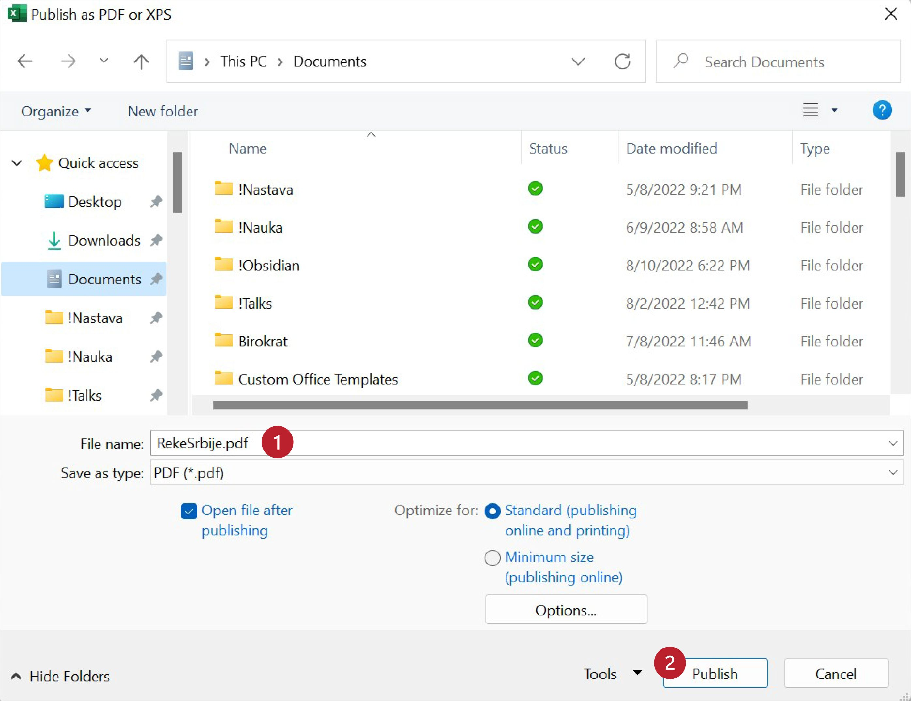

Снимање документа у ПДФ формату
====================================

Да бисмо претходни документ снимили у ПДФ формату, треба да кликнемо на „File“,
па у новом погледу одаберемо „Export“ (1), потом „Create PDF/XPS Document“ (2) и коначно
да кликнемо на дугме „Create PDF/XPS“ (3):

У прозору који се појави можемо да изменимо име документа ако то желимо (1),
и на крају кликнемо на „Publish“:

Ако ПДФ документ отворимо из неког програма за преглед ПДФ докумената видећемо нешто слично овоме:

.. Ево и кратког видеа:

   .. ytpopup:: Yu2hLG0wkLs
      :width: 735
      :height: 415
      :align: center

