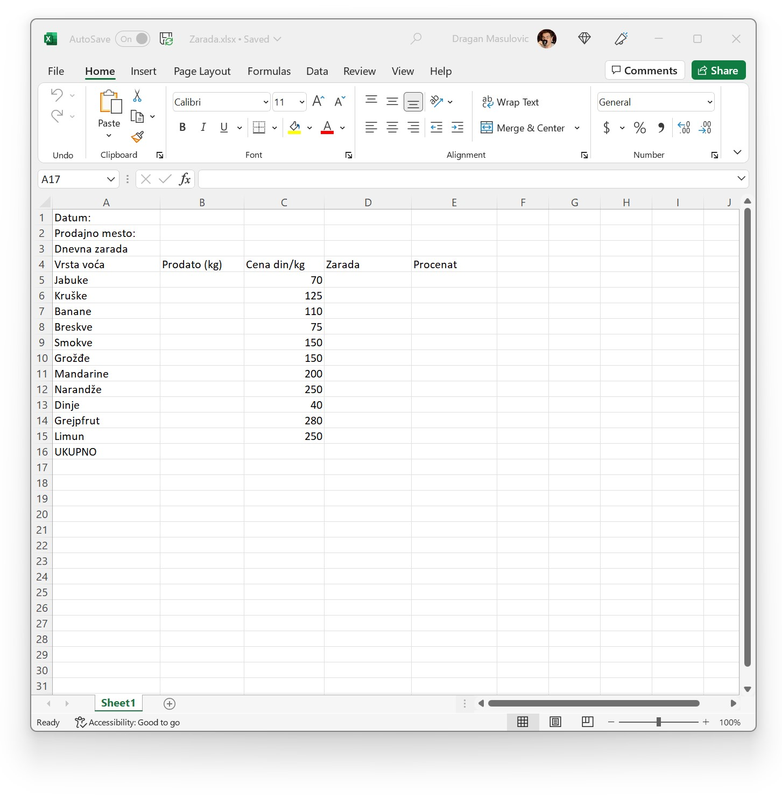
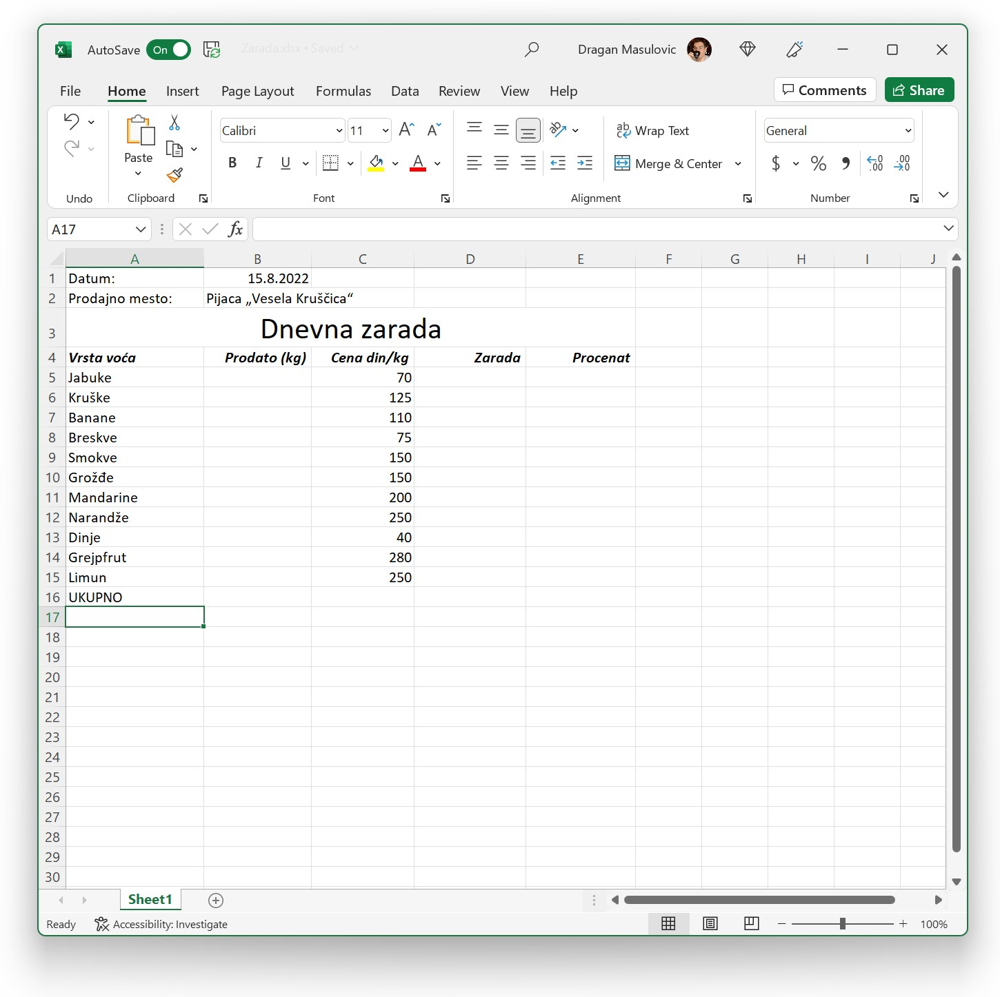
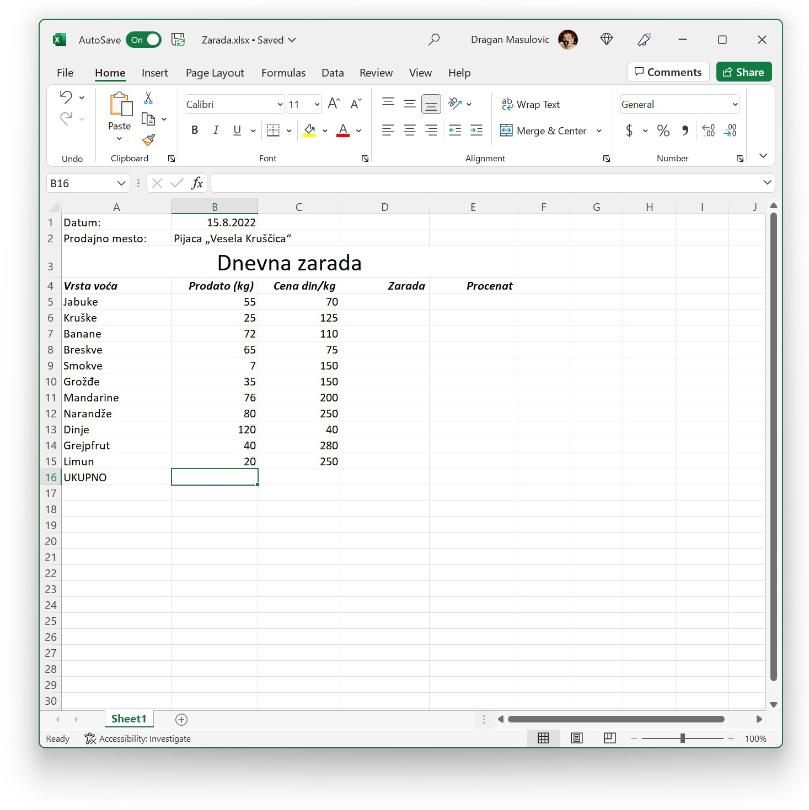
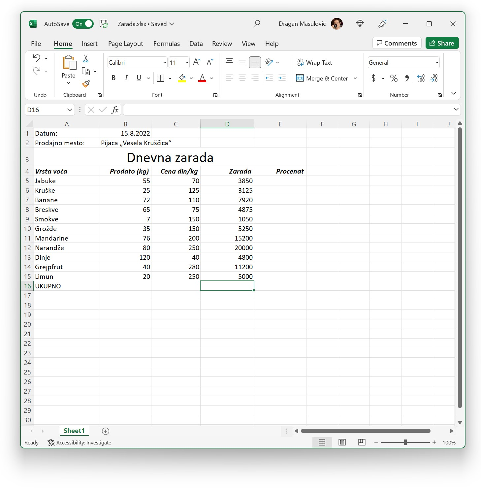
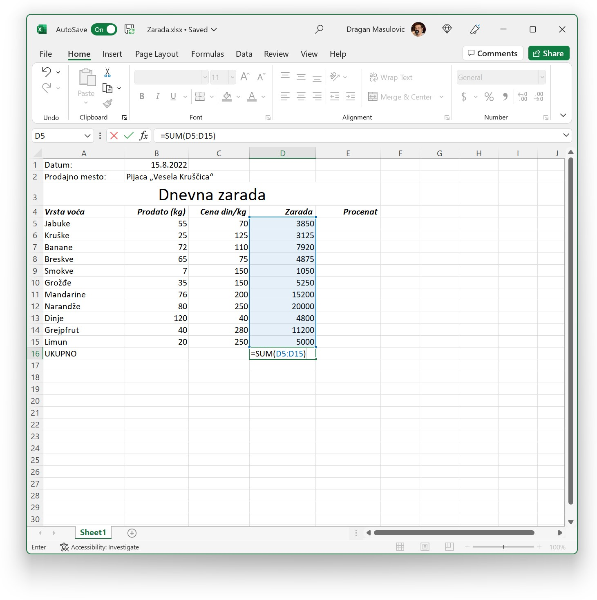
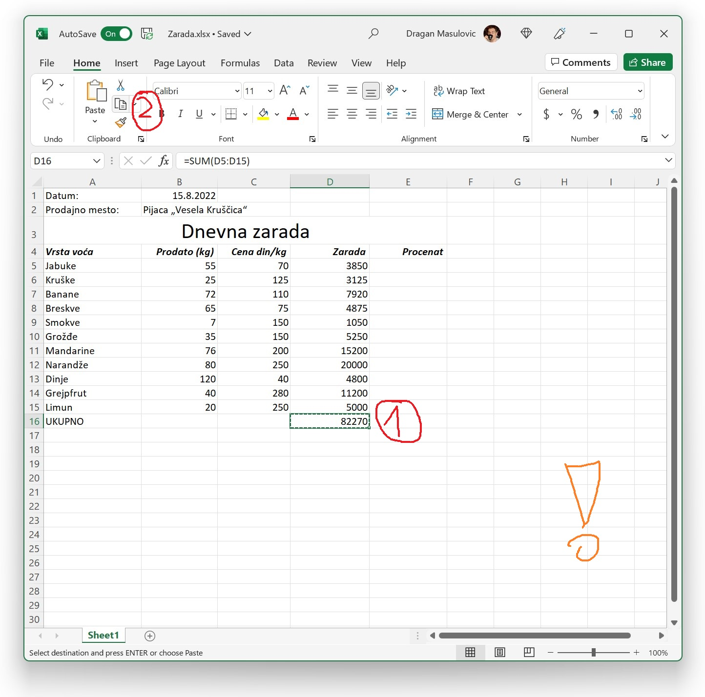
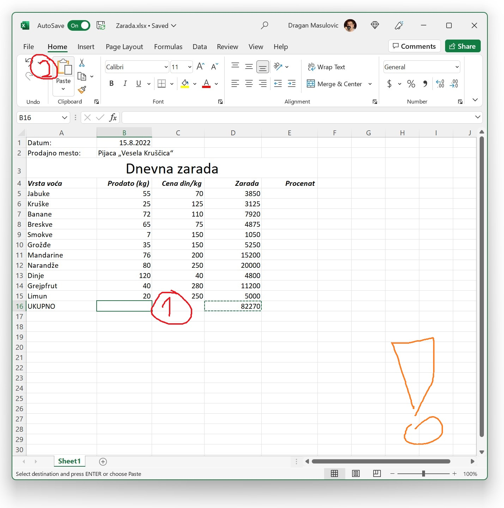
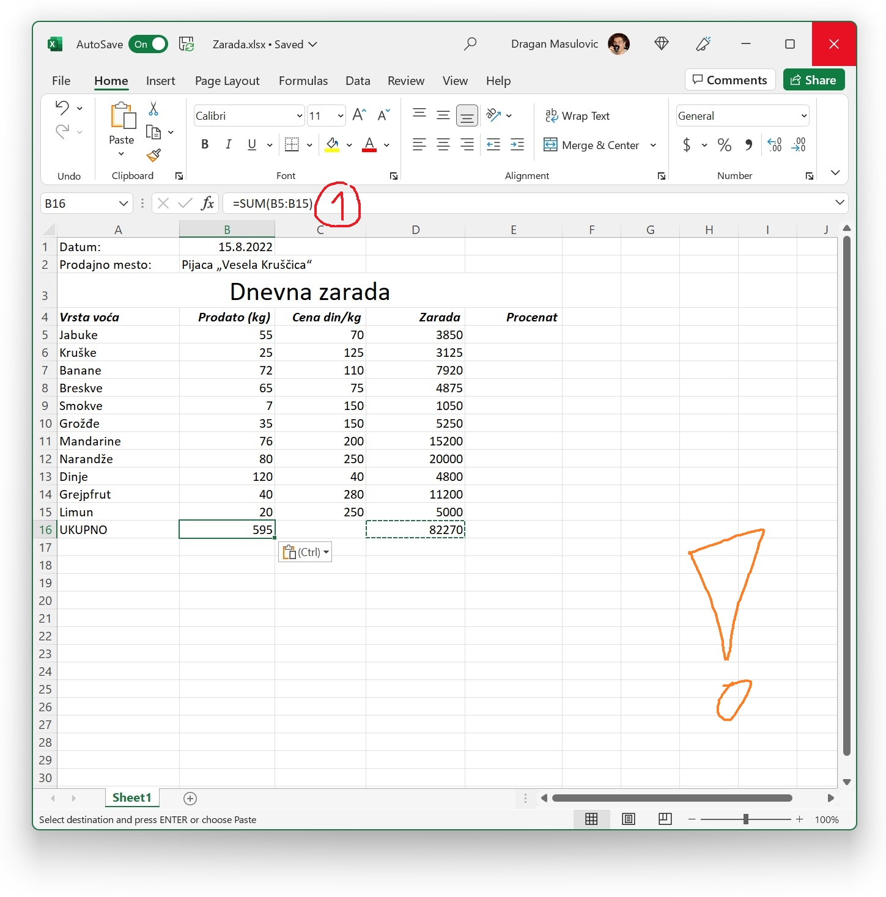

Интелигентно копирање формула
================================================

У овом примеру ћемо израчунати зараду једног продавца воћа у једном дану. За сваку врсту воћа ћемо израчунати и који удео зарада од продаје те врсте воћа чини у укупној заради продавца.

Корак 1.
--------------------

Преузми табелу *Zarada.xlsx* са следећег линка и учитај је у Ексел:

`Zarada.xlsx <https://petljamediastorage.blob.core.windows.net/root/Media/Default/Kursevi/programiranje_II/epodaci/Zarada.xlsx>`_

Табела изгледа овако:

Корак 2.
----------------------

1. У поље B1 унеси неки датум (датум за који се прави анализа), а у поље B2 унеси име продајног места (било какав текст).
2. Спој ћелије A3:E3 (*Merge Cells*) и повећај величину слова текста у новој (великој) ћелији.
3. Ћелије B4:E4 поравнај по десној ивици.
4. За стил текста у ћелијама A4:E4 одабери **bold** и *italic*.

Табела треба да изгледа отприлике овако:

Корак 3.
---------------

У ћелије B5:B15 унеси произвољне бројеве. Они представљају количину воћа која је продата, рецимо овако:

Корак 4.
--------------

За сваку врсту воћа израчунај зараду тако што ћеш у ћелију D5 унети формулу
::

    = B5*C5

и онда ту формулу „развуци“ до краја листе:

Корак 5.
-----------------

Израчунај укупну зараду тако што ћеш у ћелију D16 унети формулу
::

    =SUM(D5:D15)

Корак 6.
----------------

Даље, израчунај колико је укупно килограма воћа продато тај дан. Један начин да се то уради је, наравно, да се у ћелију B16 унесе формула
::

    =SUM(B5:B15)

али ћемо сада показати бржи начин да се то уради. Користићемо наредбе из групе „Clipboard“:

Кликом на дугме „Copy“ (1) садржај селектованог дела табеле се *копира* у посебан део меморије који се зове „Clipboard“ („подметач за писање“),
док се кликом на дугме „Paste“ (2) садржај Clipboard-а уписује у документ.

:math:`\ `

Пошто смо већ у ћелији D16 израчунали збир бројева у ћелијама D5:D15, и пошто је формула коју треба да унесемо у ћелију B15 „аналогна“, просто ћемо *ископирати* формулу из ћелије D16 у ћелију B16. Ево како.
Кликни на ћелију D16 и онда кликни на икону која одговара операцији „Copy“ („ископирај“):

.. infonote::

    У табели се ништа није десило, али је Ексел *ископирао* формулу у посебан део меморије који се зове *Clipboard*.

Сада кликни на ћелију B16 и онда кликни на икону која одговара операцији „Paste“ („налепи“) која ће садржај из *Clipboard*-а ископирати у ћелију на коју смо кликнули, *али интелигентно*:

Ексел је ископирао формулу у ћелију B16, али се прилагодио чињеници да смо формулу пренели из колоне D у колону B. Зато сада у колони B16 пише:

.. infonote::

    * Ова операција је веома важна и у жаргону се зове *Copy/Paste*.
    * Ако je садржај који се копира број, датум, време или текст, приликом копирања неће ништа бити промењено. *Али ако је садржај који се копира формула, она ће бити прилагођена положају нове ћелије и биће измењена на одговарајући начин!*  Ово својство Ексела зовемо *интелигентно копирање формула*.
    * Oперација „развлачења ћелије за бубуљицу“, коју смо до сада користили да брзо копирамо формуле, само је вишеструка примена операције *Copy/Paste*.

