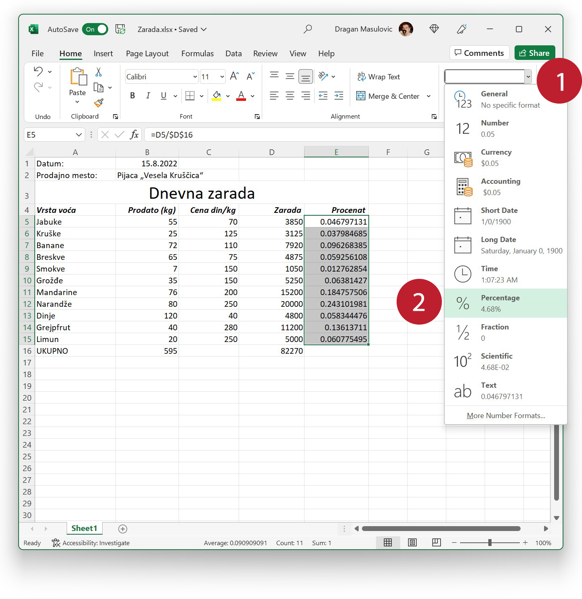

Апсолутна адреса ћелије
==================================

Сада ћемо показати нови концепт: апсолутну адресу ћелије. Механизам апсолутног адресирања ћелије нам омогућује да
*фиксирамо* ћелију тако да *приликом копирања формуле овај елемент формуле неће бити модификован*.
Показаћемо на два примера значај овог механизма.

Корак 7.
------------------------

За сваку врсту воћа израчунаћемо удео те врсте воћа у укупној заради и приказати га у облику процента. Као што смо већ видели, проценти се рачунају као обичан количник дела и целине, и онда се одговарајуће ћелије само форматирају на одговарајући начин.

.. infonote::

    У нашем примеру целину представља укупна зарада (број у ћелији D16), док су делови чији удео у целини рачунамо бројеви који представљају зараду сваке појединачне врсте воћа.

Да бисмо израчунали удео који зарада на јабукама носи у укупној заради у ћелију E5 ћемо уписати формулу
::

    = D5/D16

(количник дела и целине):

Добијамо неки децимални број који ћемо касније форматирати као проценат.
Пошто ћелије E6:E15 садрже исту формулу, само ћемо кликнути на ћелију E5 и „развући“ је до дна:

.. image:: ../../_images/Zarada10.jpg
   :width: 780px
   :align: center

.. questionnote::

    Упс! Где смо погрешили?

.. infonote::

    Ако кликнемо на ћелију E5 и притиснемо тастер [F2], Ексел ће нам показати формулу која је у ћелији и означиће ћелије које учествују у формули:

.. image:: ../../_images/Zarada11.jpg
   :width: 780px
   :align: center

Формула у ћелији E5 је добра. (Како не би била када смо је ручно унели.)

Хајде сада да кликнемо на ћелију E6 и притиснемо тастер [F2]:

.. image:: ../../_images/Zarada12.jpg
   :width: 780px
   :align: center

Ето зашто се Ексел буни: формула у ћелији E6 гласи
::

    = D6/D17

и D6 је добро (то је зарада на крушкама), али D17 је празна ћелија. Када се број у ћелији D6 подели ничим добије се грешка, наравно.

Зашто смо добили ову формулу? Погледајмо табеларни приказ ситуације:

.. csv-table:: Шта смо добили и шта желимо
   :header: "Ћелија", "Формула у ћелији", "Формула коју желимо"
   :align: left

   "E5", "= D5/D16", "= D5/D16"
   "E6", "= D6/D17", "= D6/D16"

Када смо формулу из ћелије E5 ископирали у ћелију E6, пренели смо формулу један ред ниже. Тако је D5 постало D6, што нам одговара, али је D16 постало D17, што нам *никако не одговара*.
Волели бисмо када бисмо могли да убедимо Ексел да при преласку са E5 на E6 он промени D5 на D6, али желимо да при томе D16 остане D16. И то је, наравно, могуће!

Обрисаћемо сада све (селектујемо ћелије E5:E15) и притиснемо тастер [Del] (или [Delete]) на тастатури:

Поново ћемо у поље E5 унети формулу, али овај пут ћемо написати:
::

    = D5/$D$16

Симболима \$ које смо додали испред имена колоне и броја врсте ћелије D16 смо *фиксирали* ту ћелију: *приликом копирања формуле овај елемент формуле неће бити модификован; он ће увек остати \$D\$16*.

.. image:: ../../_images/Zarada15.jpg
   :width: 780px
   :align: center

Да се уверимо да је то заиста тако ископираћемо формулу из ћелије E5 у ћелију E6 користећи *Copy/Paste* акцију. Ако притиснемо тастер
[F2] док стојимо на ћелији E6, видимо да је у њу уписана формула
::

    = D6/$D$16

Дакле, приликом копирања формуле из E5 у E6, D5 постало D6, али је \$D\$16 остало \$D\$16.

Сада слободно можемо да кликнемо на ћелију E6 и „развучемо“ формулу до дна табеле:

.. image:: ../../_images/Zarada17.jpg
   :width: 780px
   :align: center

У свакој ћелији се налази коректна формула. На пример,

.. image:: ../../_images/Zarada18.jpg
   :width: 780px
   :align: center

.. infonote::

    * Адреса ћелије као што је D6 се зове *релативна адреса* зато што је Екселу приликом копирања формуле дозвољено да је мења.
    * Адреса ћелије као што је \$D\$16, која је *фиксирана*, зове се *апсолутна адреса* зато што Екселу приликом копирања формуле **није** дозвољено да је мења (зато је *апсолутна, непроменљива*).

Корак 8.
---------------------------

За крај треба још бројеве које смо добили у колони E приказати у облику процента. Да бисмо то постигли, селектоваћмо ћелије E5:E15 и као формат приказа одабрати „Percentage“:

Добијамо:

.. image:: ../../_images/Zarada20.jpg
   :width: 780px
   :align: center

За крај, сними табелу као Ексел фајл и као ПДФ фајл.

