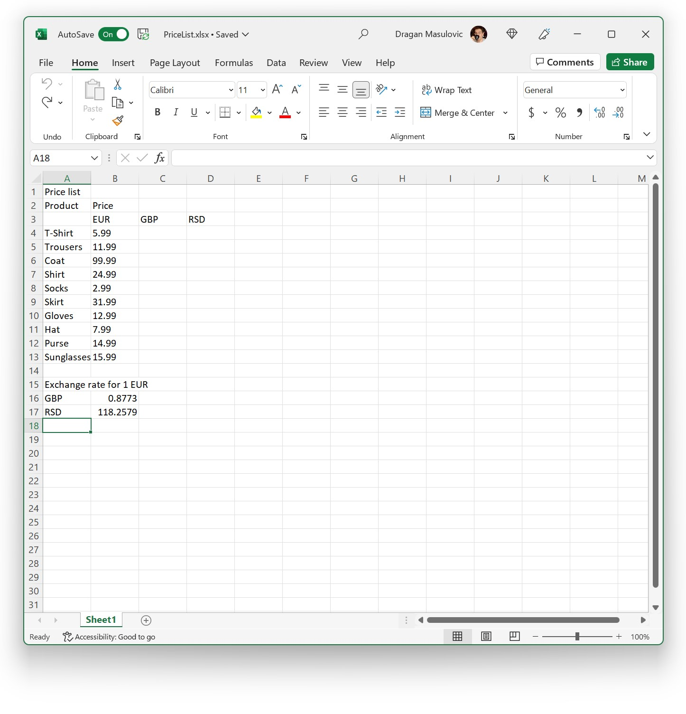
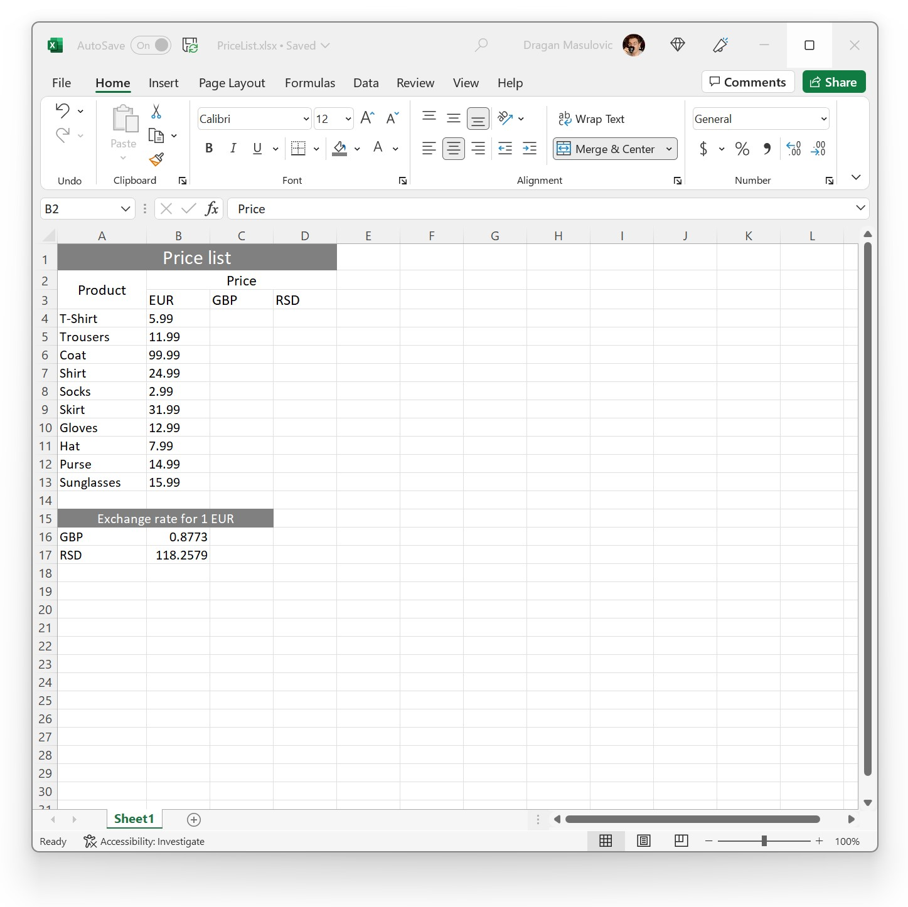
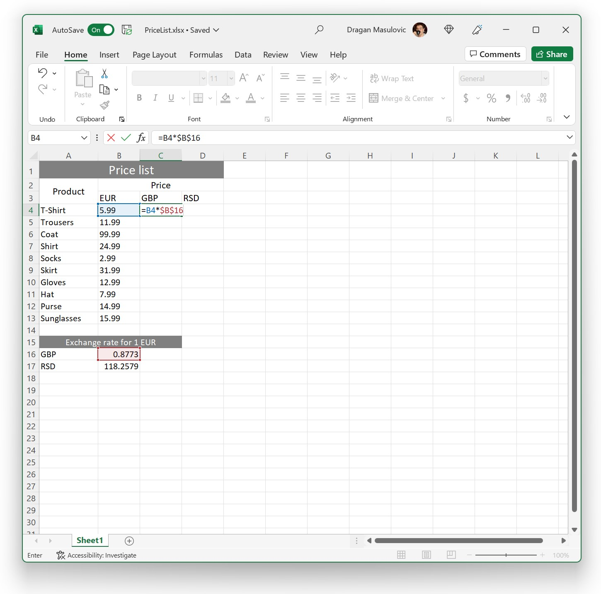
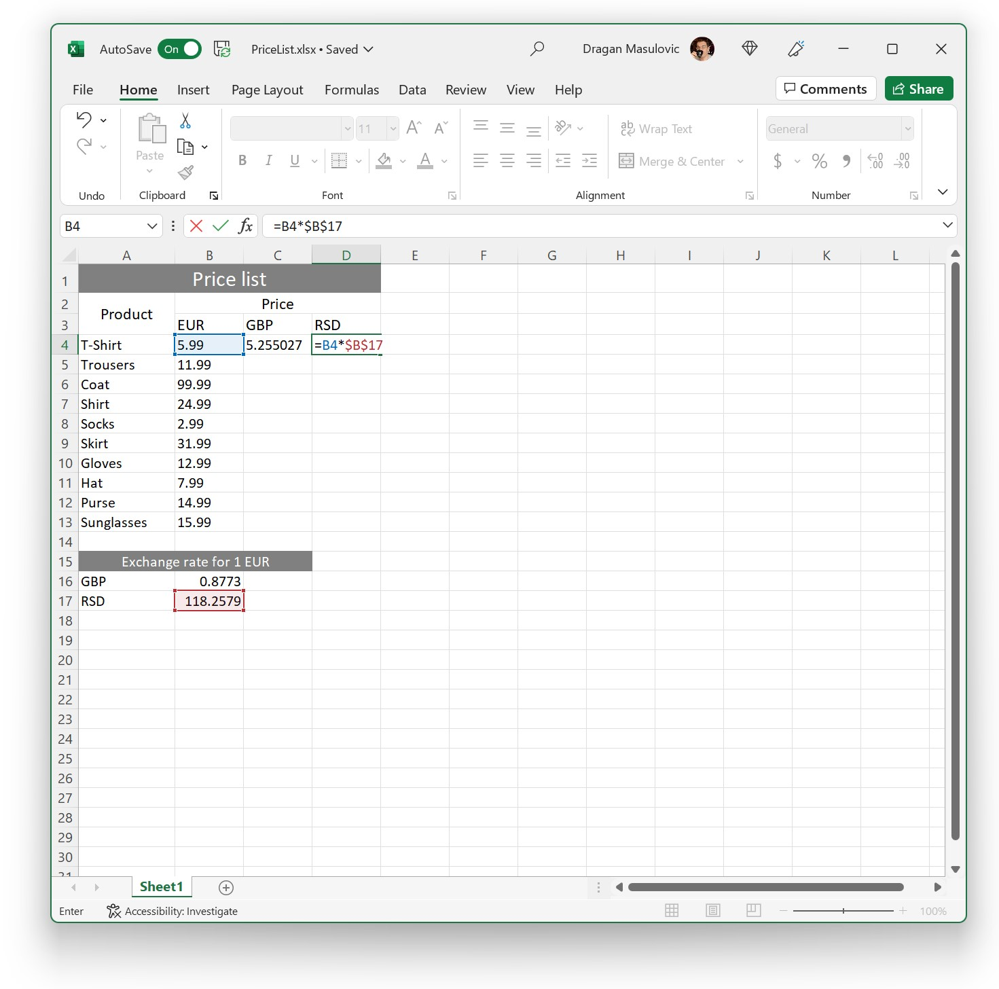
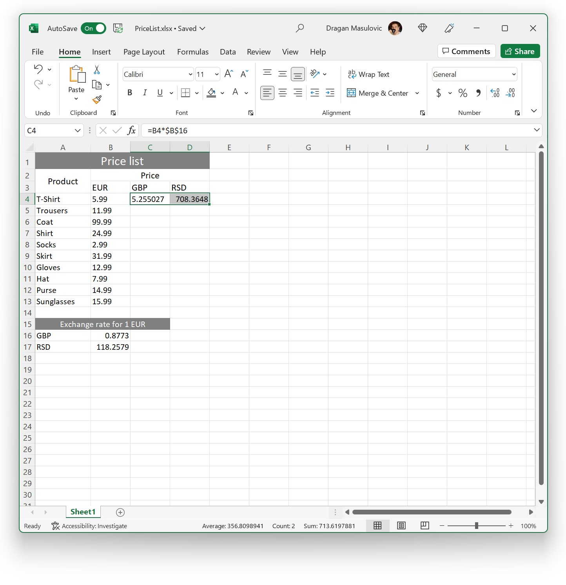
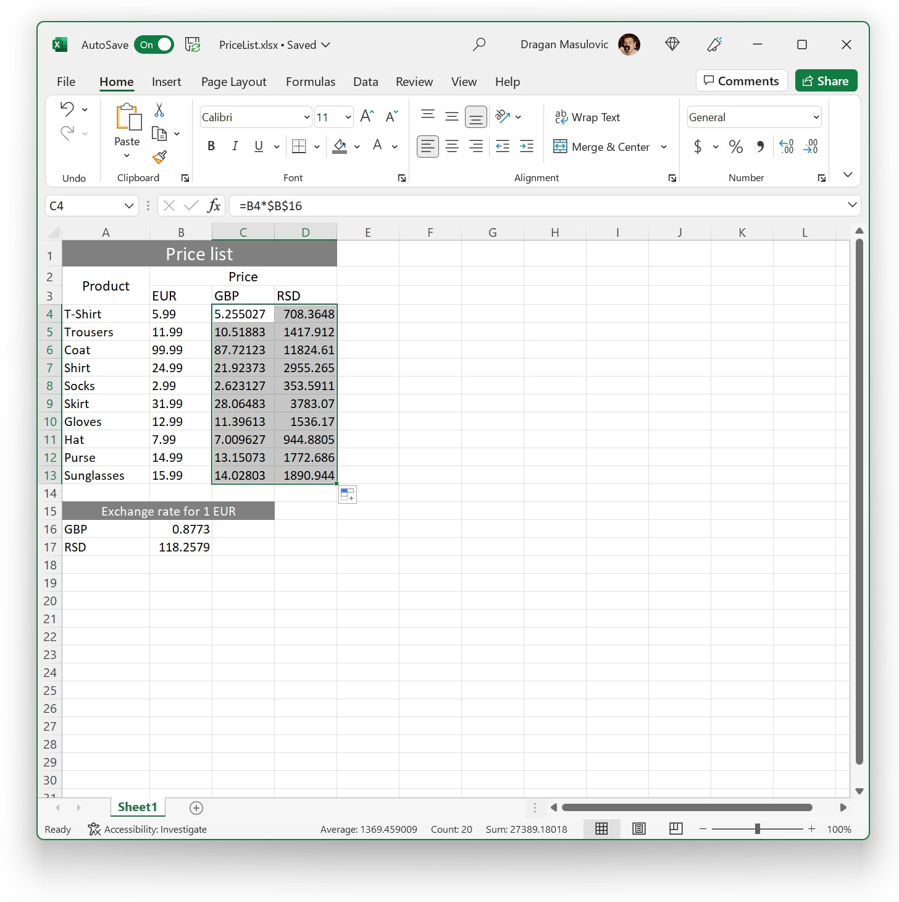
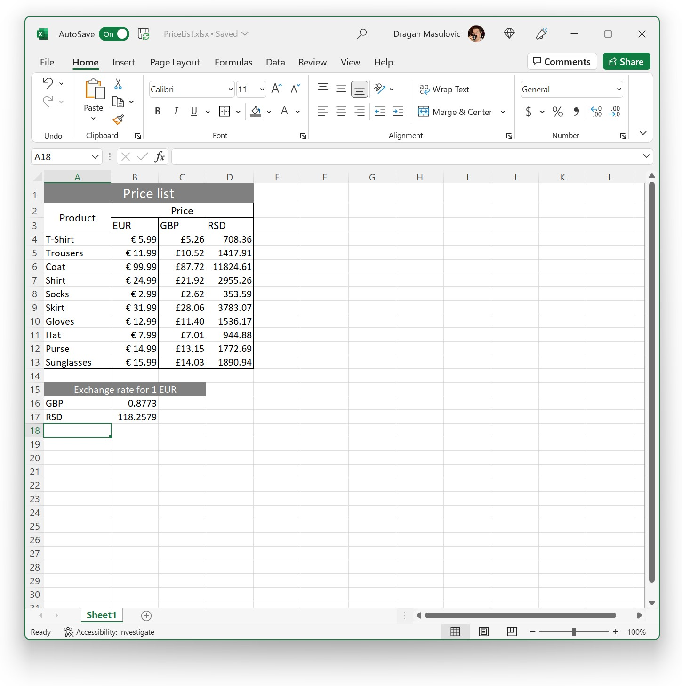

Прерачун валута
==============================

Показаћемо сада још један пример у коме се природно користе апсолутне адресе ћелија.

Корак 1.
------------------------------

Са следећег линка преузми документ *PriceList.xlsx*, који садржи ценовник једне радње у три валуте: еврима, британским фунтама и динарима:

`PriceList.xlsx <https://petljamediastorage.blob.core.windows.net/root/Media/Default/Kursevi/programiranje_II/epodaci/PriceList.xlsx>`_

Табела изгледа овако:

Корак 2.
--------------------------------

Прво ћемо мало да улепшамо табелу.

1. Спој (*Merge Cells*) ћелије A1:D1 (наслов табле), постави величину слова на 16, обој позадину ових ћелија тамно-сиво, а слова бело.
2.	Постави величину слова у ћелијама A2:D3 на 12.
3.	Спој (*Merge Cells*) ћелије A15:C15 (наслов мале табеле); обој позадину ових ћелија тамно-сиво, а слова бело.
4.	Прошири колоне A, B, C и D тако да сав садржај буде видљив.
5.	Спој (*Merge Cells*) ћелије A2 и A3 и центрирај садржај *вертикално*.
6.	Спој (*Merge Cells*) ћелије B2:D2.

Табела сада изгледа овако:

Корак 3.
--------------------

Израчунаћемо цене производа у британским фунтама и у динарима на основу курса евра који је дат у малој табели. Да бисмо израчунали цену првог производа у британским фунтама у ћелију C4 ћемо унети
::

    = B4*$B$16

У овој формули ћелија B4 није фиксирана јер приликом копирања формуле у следећи ред желимо да она постане B5
(и тако добијемо формулу која конвертује у британске фунте цену наредног производа на листи).
С друге стране, ћелија B16 је фиксирана изразом \$B\$16 јер се на сваки ред табеле примењује курс фунте из ћелије B16,
и то не треба да се мења приликом копирања формуле.

Из истог разлога ћемо у ћелију D4 унети формулу
::

    = B4*$B$17

Сада можемо ове две формуле да брзо ископирамо у остатак табеле. Селектоваћемо ћелије C4:D4

и „развући“ их до дна табеле:

Корак 4.
------------------------

За крај ћемо још мало улепшати табелу.

1. Прикажи све цене на две децимале.
2. Поравнај по десној ивици садржај у ћелијама B3:D13.
3. Испред цена у фунтама додај симбол за британску фунту, а испред цена у еврима додај симбол за евро.
4. Уоквири следеће групе ћелија користећи опцију „Outside Borders“: A2:A13, A2:D3, B3:B13, C3:C13, D3:D13

Табела на крају треба да изгледа овако:

Корак 5.
--------------------

Сними табелу и као Ексел фајл и као ПДФ фајл.

