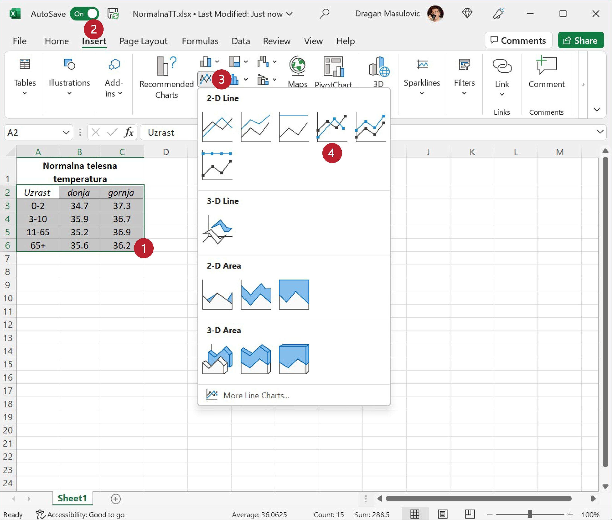
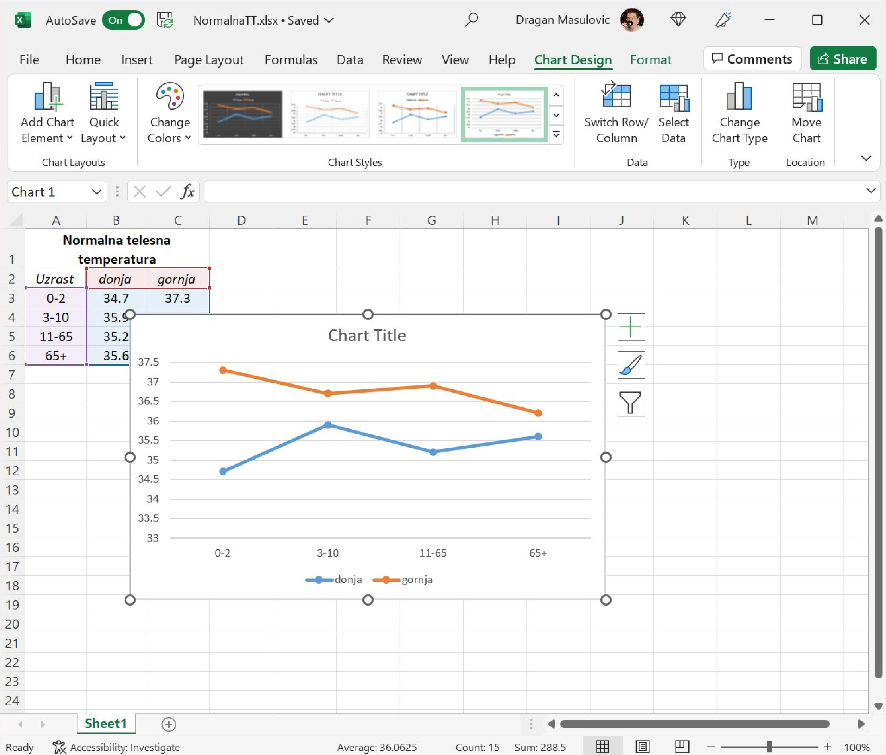
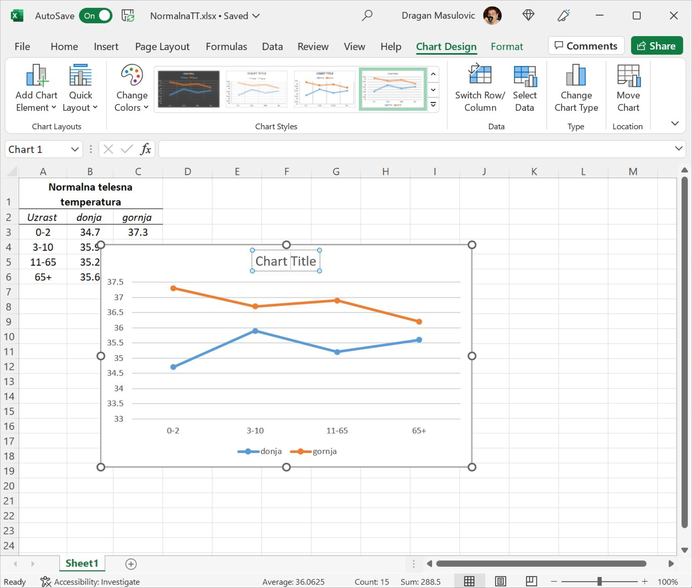
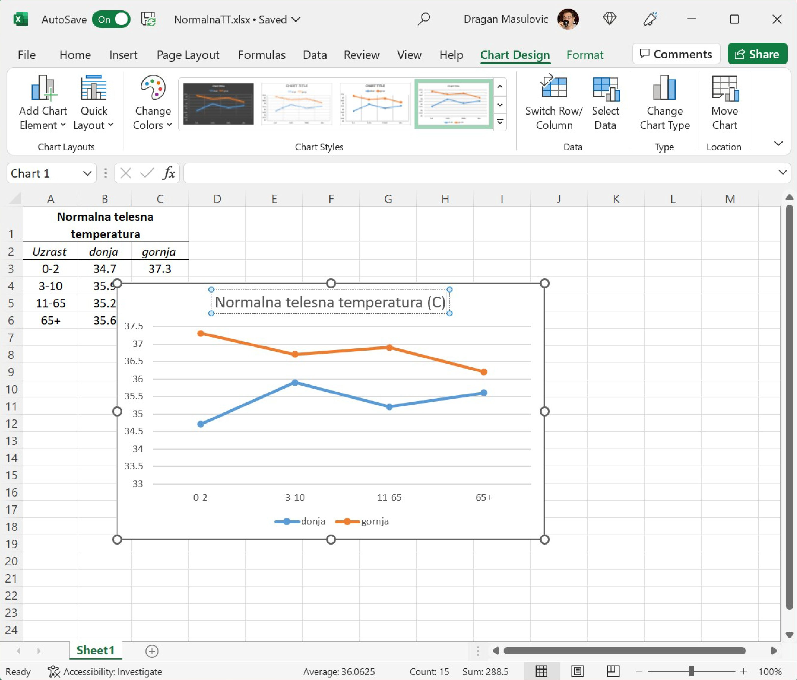
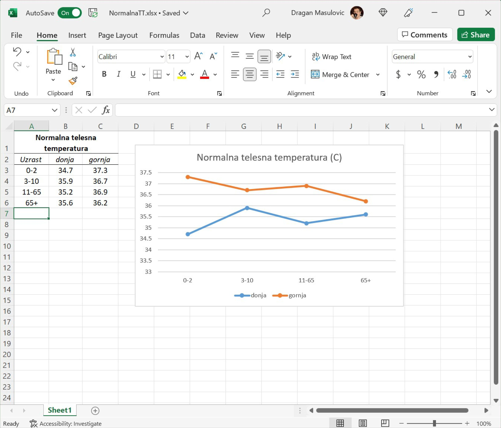

Приказивање две групе података на истом дијаграму
==========================================================

На истом графикону је
могуће приказати две групе података како бисмо могли да их упоредимо.
Овом приликом нећемо показати неки нови тип дијаграма, већ ћемо користити типове
дијаграма које смо раније могли видети како бисмо визуелизовали две групе података.

Корак 1.
----------------

„Нормална телесна температура“ је заправо интервал температура који се мења са узрастом особе.
Када се температура мери испод пазуха, нормална телесна температура (у степенима Целзијуса) је описана табелом *NormalnaTT.xlsx*,
коју можеш да преузмеш са следећег линка:

`NormalnaTT <https://petljamediastorage.blob.core.windows.net/root/Media/Default/Kursevi/informatika_VIII/epodaci/NormalnaTT.xlsx>`_

Табела изгледа овако:

.. figure:: ../../_images/ntt1.jpg
   :width: 780px
   :align: center
   :class: screenshot-shadow

Корак 2.
------------------

1. Селектуј ћелије A2:C6,
2. одабери радну траку „Insert“,
3. из групе „Charts“ одабери опцију „Line Chart“ (*линијски дијаграми*),
4. па од понуђених стилова одабери стил као на слици:

Добили смо графикон као на слици:

Корак 3.
--------------

Приметићеш да је Ексел приказао две групе података на истом графикону, додао је на графикону и легенду,
*али није успео да схвати како цео графикон треба да се зове* па је зато ставио „Chart Title“ као подсетник да морамо ручно да унесемо име графикона.

Ако кликнемо на „Chart Title“ једном да га селектујемо, па онда још једном (дакле, не двоклик *тик-тик*,
већ два клика *клик-пауза-клик*), појавиће се курсор:

Сада можемо да унесемо име графикона:

и да прераспоредимо елементе табеле, ако је то потребно:

.. Ево и кратког видеа:

   .. ytpopup:: sOY23G9t1lE
      :width: 735
      :height: 415
      :align: center
   :class: screenshot-shadow

