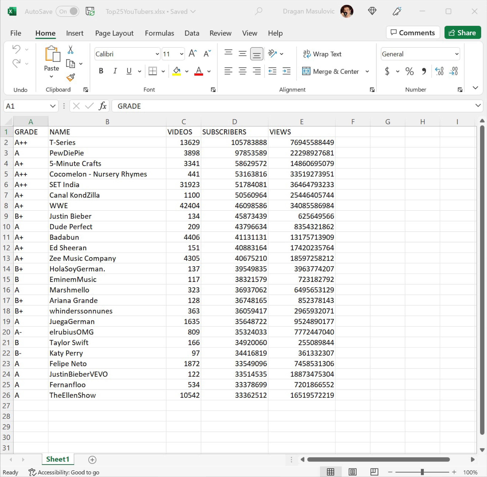
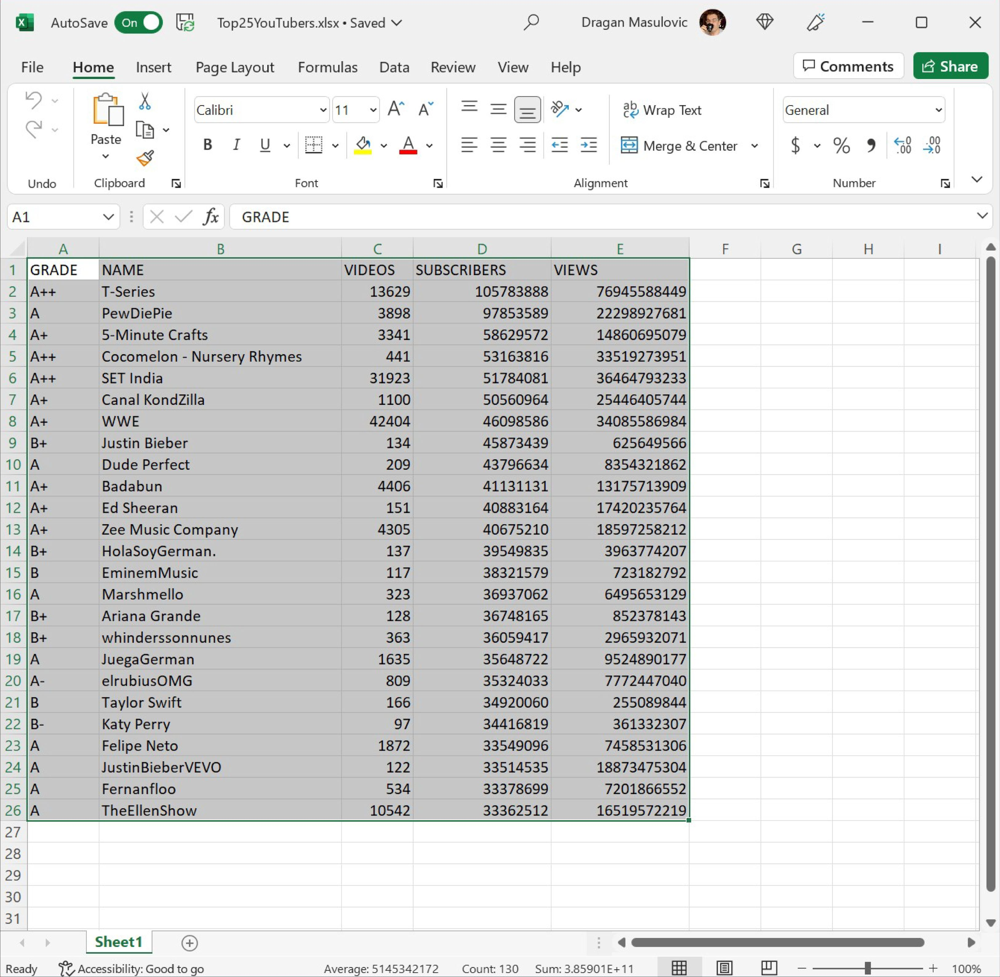
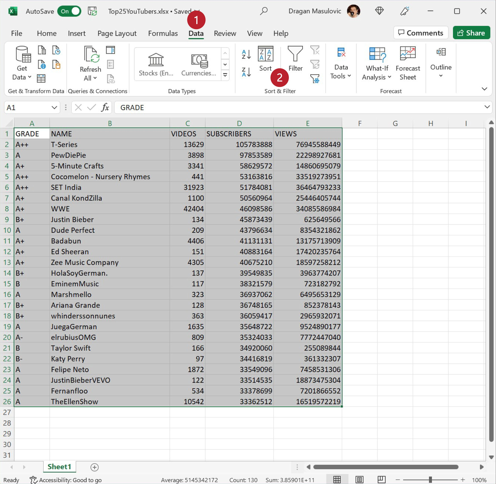
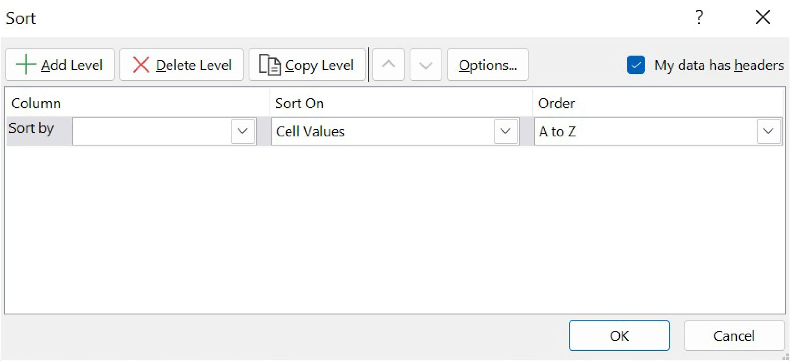
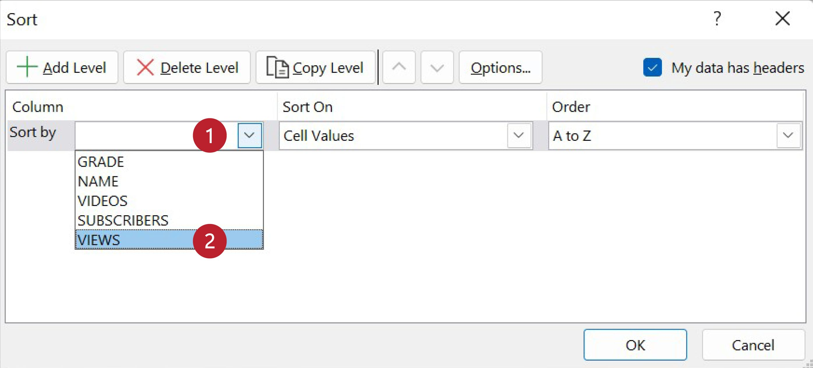
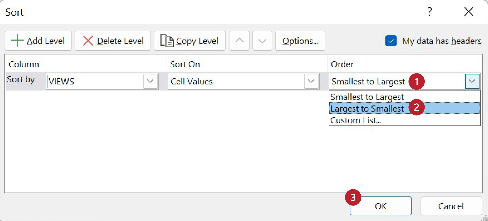
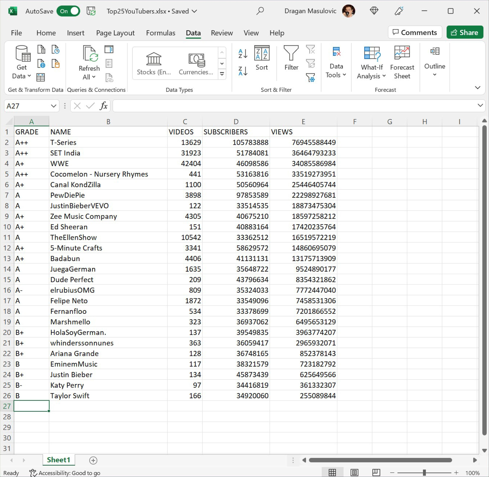
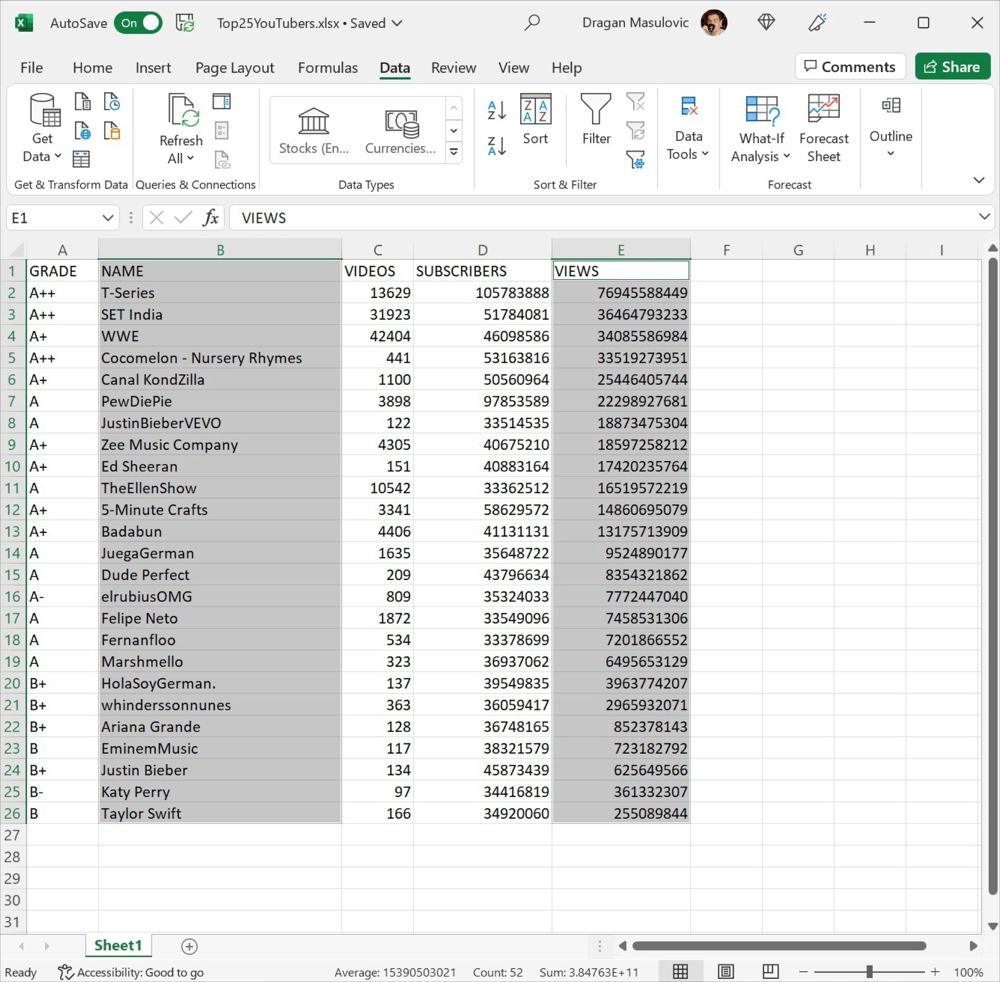
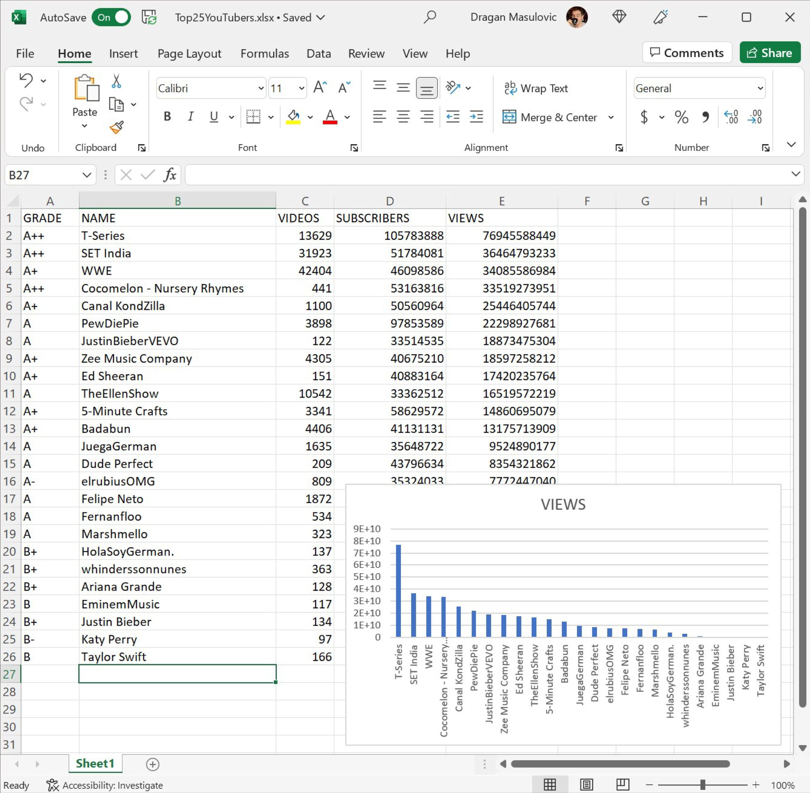

Сортирање података
=========================

Показаћемо сада како се у Екселу могу сортирати табеле.
Приликом сортирања Ексел преуређује врсте табеле
тако да бројеви уписани у неку колону буду поређани по величини.

.. infonote::

   Ексел може да сортира и нумеричке податке (бројеве) и текстуалне податке (рецимо, имена)!

Прво ћемо показати сортирање нумеричких података.

Корак 1.
-----------------

Са следећег линка преузми документ *Top25YouTubers.xlsx* и сними га на свој рачунар:

`YouTubers.xlsx <https://petljamediastorage.blob.core.windows.net/root/Media/Default/Kursevi/informatika_VIII/epodaci/Top25YouTubers.xlsx>`_

Табела садржи податке о првих 25 YouTube канала према броју претплатника на дан 1. јул 2019:

За сваки канал је наведен његов YouTube ранг (GRADE), име канала (NAME), колико је видеа објављено на каналу (VIDEOS),
колико има претплатника (SUBSCRIBERS) и колико има прегледа (VIEWS). Табела jе сортирана по броју претплатника.

Корак 2.
----------------

Сортираћемо сада табелу по броју прегледа (VIEWS). Селектоваћемо целу табелу *заједно са првом врстом у којој су наведена имена колона*:

Прећи ћемо на командну траку „Data“ и одабрати опцију „Sort“:

Појавиће се прозор у коме можемо да одаберемо колону по којој ће бити сортирана табела:

Кликни на стрелицу поред „Sort by“ (1),
па у листи која се појавила (2) одабери „VIEWS“
јер желимо да сортирамо табелу по броју прегледа (колона „VIEWS“):

Потом у одељку „Order“ („редослед“) кликнемо на стрелицу (1), па у листи која се појавила одаберемо „Largest to Smallest“ (2)
јер желимо да сортирамо табелу од већих ка мањим вредностима. (Да смо којим случајем правили „листу срама“, одабрали бисмо опцију „Smallest to Largest“,
која би наложила Екселу да сортира табелу од канала са најмање прегледа до канала са највише прегледа.)
Онда кликни на „OK“ (3):

Када кликнемо на „OK“, добијамо сортирану табелу (редови су испремештани тако да на првом месту буде канал са највише прегледа):

.. Ево и кратког видеа:

   .. ytpopup:: 8LVLF73jbhE
      :width: 735
      :height: 415
      :align: center

Корак 3.
----------------

Прикажимо број прегледа по каналима хистограмом. Означимо ћелије B1:B26 и онда *притиснемо тастер [CTRL] и држећи га притиснутог* означимо још и ћелије E1:E26.

Онда одаберемо командну траку „Insert“ и са ње опцију за креирање стубичастих дијаграма, па одаберемо стил који нам се највише свиђа. Ако је потребно, преместимо дијаграм да не прекрива податке:

