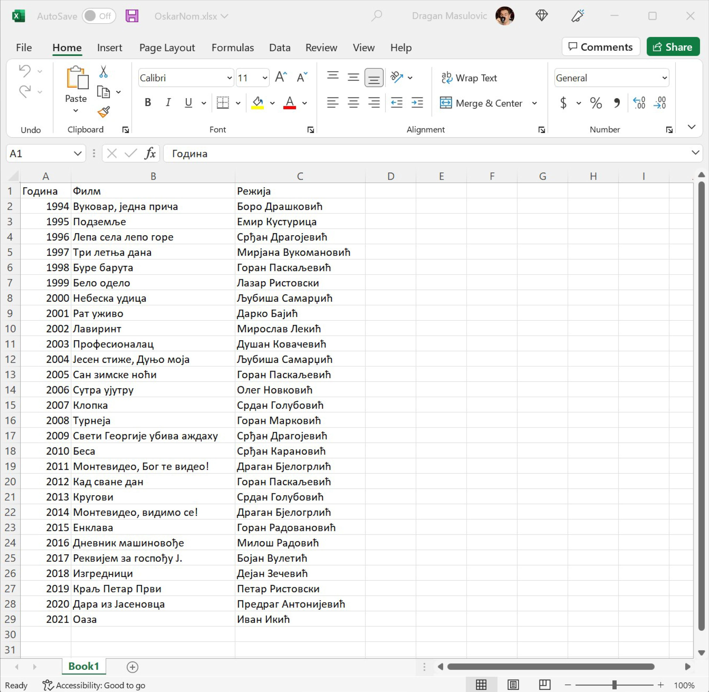
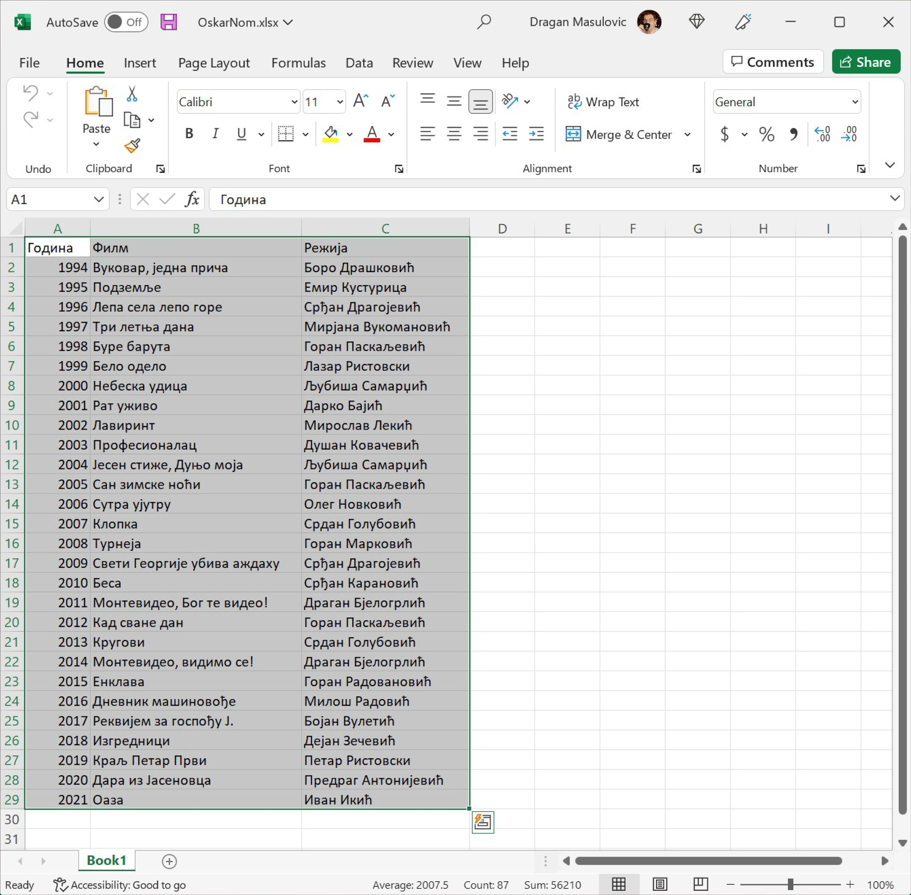
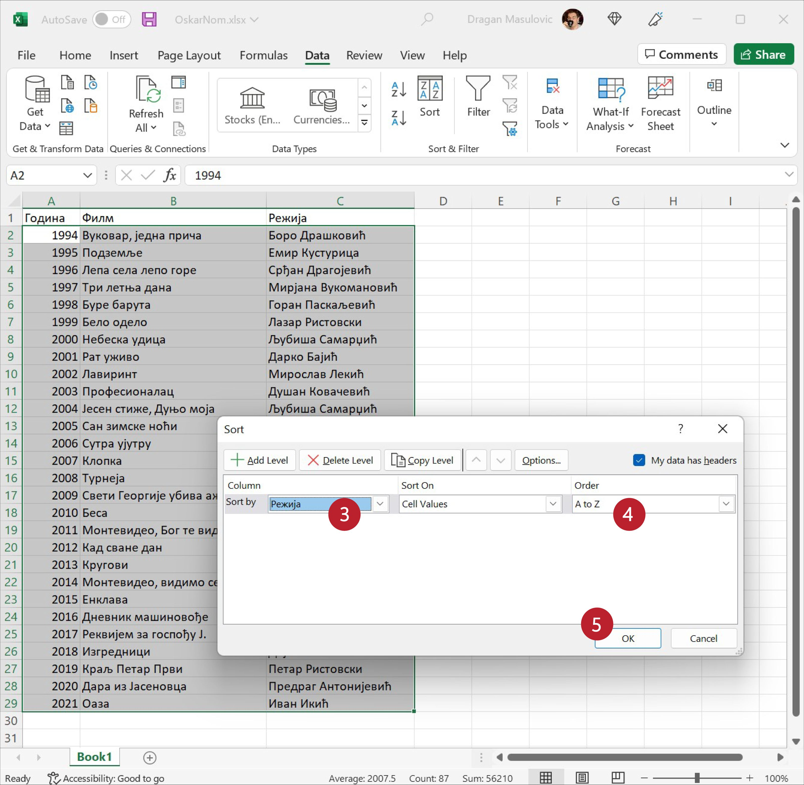
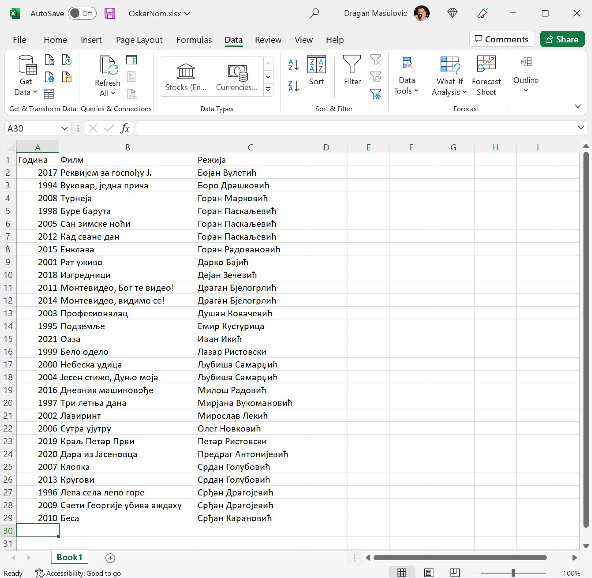

Сортирање текстуалних података
==================================================

Показаћемо сада да Ексел може да сортира и текстуалне податке
(на пример, списак ученика по презимену). Процедура је иста као
у случају сортирања бројева, с тим да ће редослед сортираних података
зависити од писма, што и не изненађује! Рецимо, ако треба по имену ученика
сортирати табелу у којој су имена написана ћирилицом, Ексел ће их сортирати азбучно,
а ако су имена написана латиницом -- абецедно.

.. infonote::

   Текстуални подаци се сортирају према *лексикографском* поретку.
   Лексикографски поредак зависи од редоследа слова у писму којим су подаци
   записани.

.. questionnote::

    Потражи на Интернету или питај наставника шта је то *лексикографија*
    (помоћ: „λέξις“ на грчком значи *реч*; „γραφία“ на грчком значи *записивање*).

На пример, приликом сортирања речи записаних ћирилицом, реч „азбука“ ће се
појавити пре речи „амбуланта“ зато што се у ћирилици слово „з“ јавља пре слова „м“.
С друге стране, ако су речи записане латиницом тада ће се реч
„ambulanta“ појавити пре речи „azbuka“ јер се у латиници слово „m“ јавља пре слова „z“.

Корак 1
-------------------

Са следећег линка

`OskarNom.xlsx <../../_static/OskarNom.xlsx>`_

преузми фајл који садржи списак свих наших филмова који су номиновани за популарну филмску
награду „Оскар“ и отвори га:

Корак 2
-------------------

Видимо да је табела сортирана по годинама када је филм номинован.
Сортираћемо сада табелу по режисерима. Селектуј све податке у табели, укључујући и имена колона:

Корак 3
-------------------

Пређи на командну траку „Data“ (1), кликни на дугме „Sort“ (2), па у менију који се појави
у листи „Sort by“ (3) одабери „Режија“, у листи „Order“ (4) провери да стоји
„A to Z“ (што значи да ће сортирање ићи од А до Ш јер су подаци ћирилични!) и кликни „OK“ (5):

Добијамо табелу сортирану по имену и презимену режисера:

.. infonote::

   Уколико су подаци унети у табелу латичичним писмом, поступак је исти!

