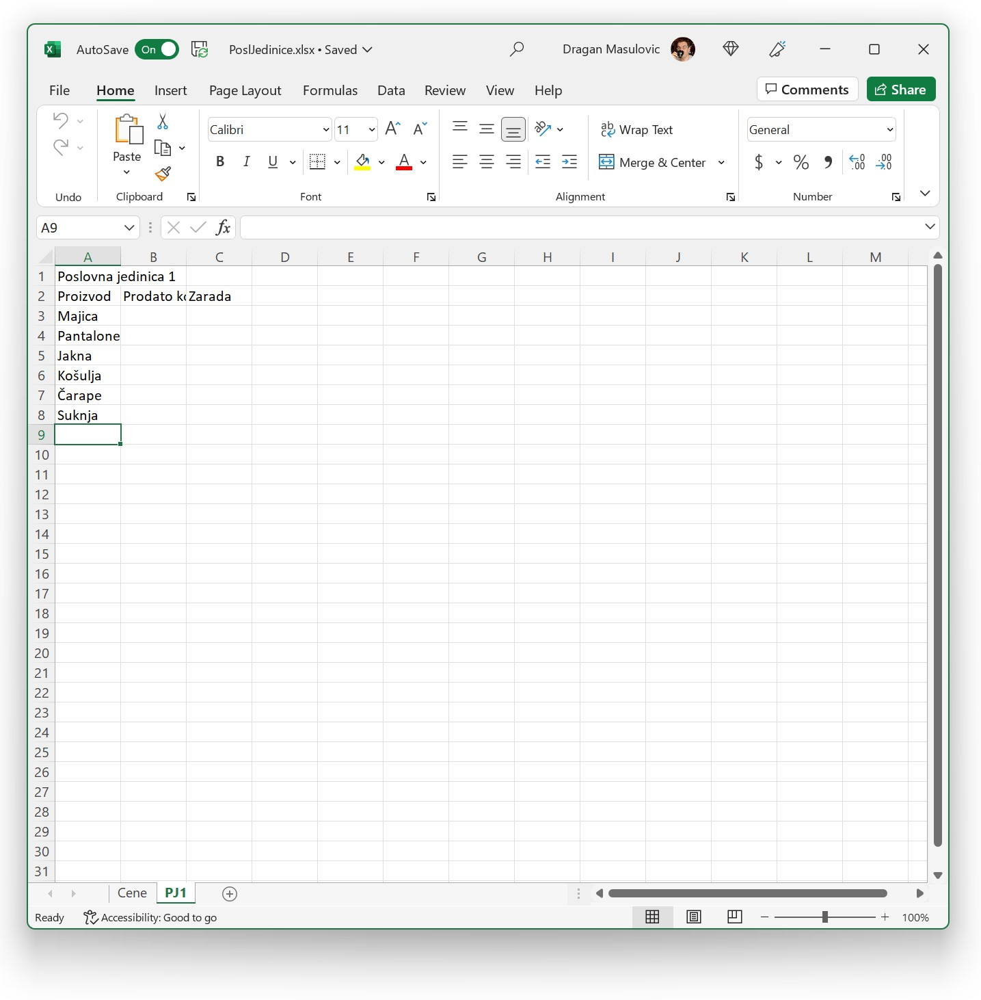
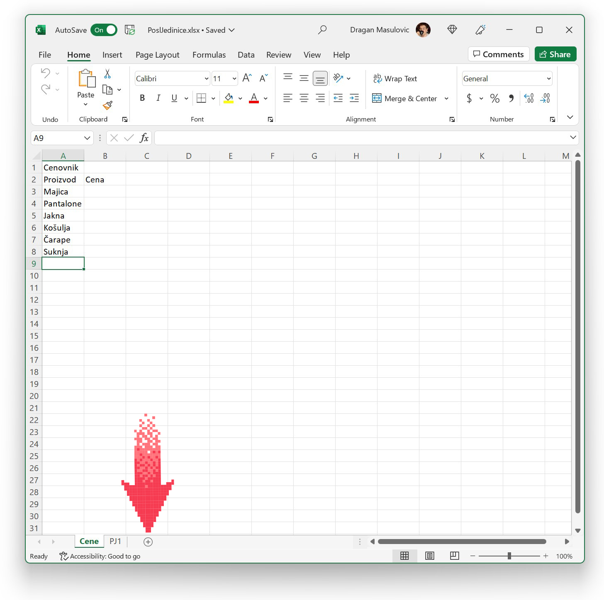
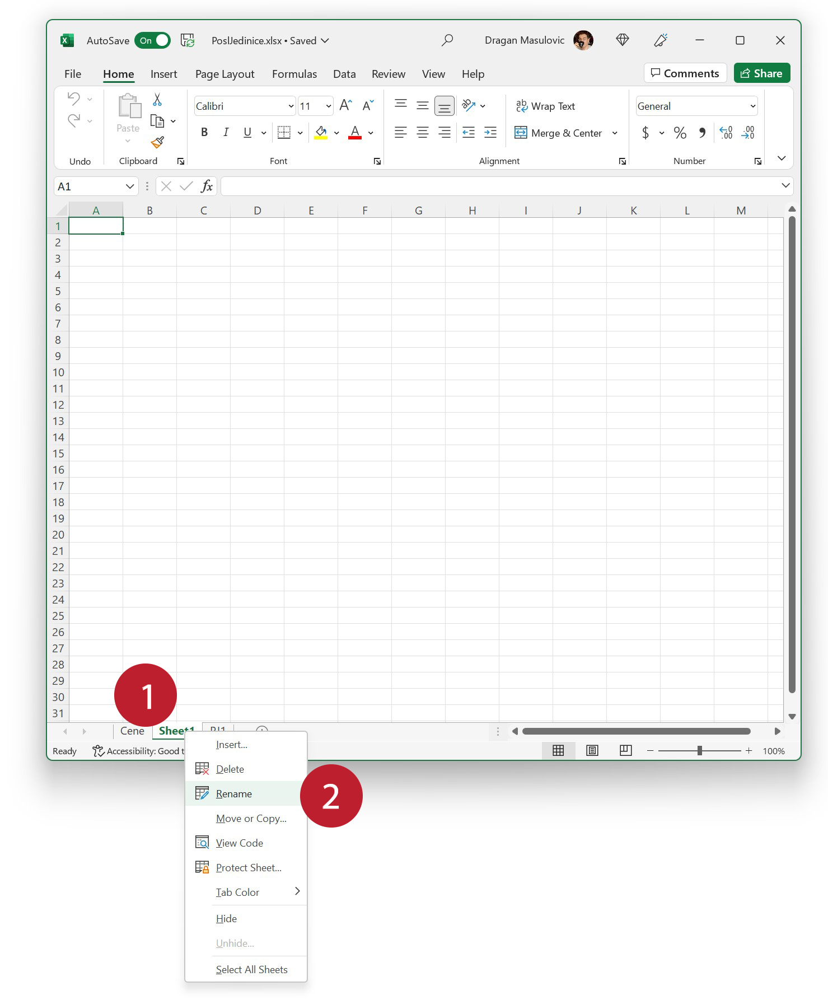
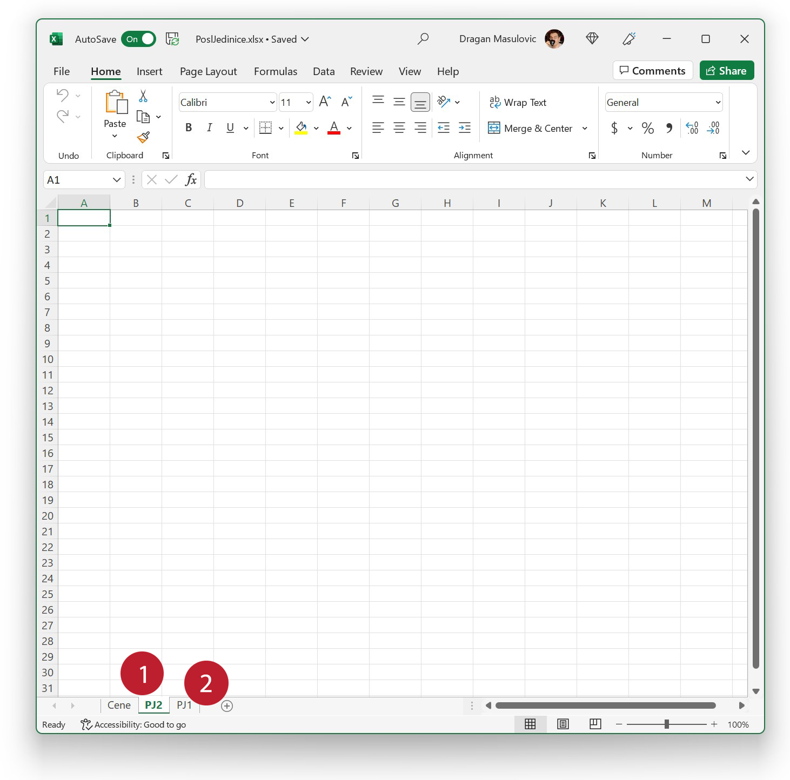

Радни листови
===================================

Са следећег линка преузми документ *PoslJedinice.xlsx*

`PoslJedinice.xlsx <https://petljamediastorage.blob.core.windows.net/root/Media/Default/Kursevi/programiranje_II/epodaci/PoslJedinice.xlsx>`_

и отвори га у Екселу:

.. image:: ../../_images/PJ1.jpg
   :width: 780px
   :align: center

Документ на дну има два „језичка“. Ови „језичци“ се на енглеском језику зову „табови“ (*tabs*). Сваки од њих представља по један радни лист на коме ћемо креирати своје табеле.
Тренутно видимо радни лист „Cene“, а ако желимо да видимо радни лист „PJ1“ (од „Пословна Јединица 1“) који је испод, треба да кликнемо на таб „PJ1“:

Вратимо се на таб „Cene“:

Овај документ треба да садржи преглед пословања једне мале фирме која продаје одећу и има три пословне јединице. Документу ћемо додати још три радна листа који ће се звати овако:

* „PJ2“ („Пословна Јединица 2“),
* „PJ3“ („Пословна Јединица 3“), и
* „Pregled“.

Корак 1.
----------------

Да бисмо додали нови радни лист, треба да кликнемо на мали знак :math:`\oplus` који се налази поред табова („додај нови радни лист“). Добијамо:

Ексел је уметнуо нови радни лист *непосредно иза* радног листа који је био активан и дао му је име „Sheet1“, јер се радни листови на енглеском зову *work sheets*.

Корак 2.
---------------

Променићемо име новог радног листа у „PJ2“ тако што ћемо кликнути *десним* тастером миша на таб „Sheet1“ и из менија који се појави одабрати „Rename“:

(Ако желимо да обришемо радни лист који смо грешком додали, из горњег менија треба одабрати „Delete“.)

Онда ћемо укуцати ново име радног листа, „PJ2“ у нашем случају:

и притиснути [ENTER].

Корак 3.
------------------

Редослед је погрешан јер се „PJ2“ јавља пре „PJ1“. Да бисмо то исправили, „ухватићемо“ мишем таб „PJ2“ и *не пуштајући тастер* превући га десно од „PJ1“:

Када отпустимо тастер, таб се налази на свом месту:

Корак 4.
-------------------

За крај овог дела додаћемо још два радна листа, „PJ3“ и „Pregled“:

.. image:: ../../_images/PJ9.jpg
   :width: 780px
   :align: center

.. Ево и кратког видеа:

   .. ytpopup:: 2DxqJXhj0XQ
      :width: 735
      :height: 415
      :align: center

