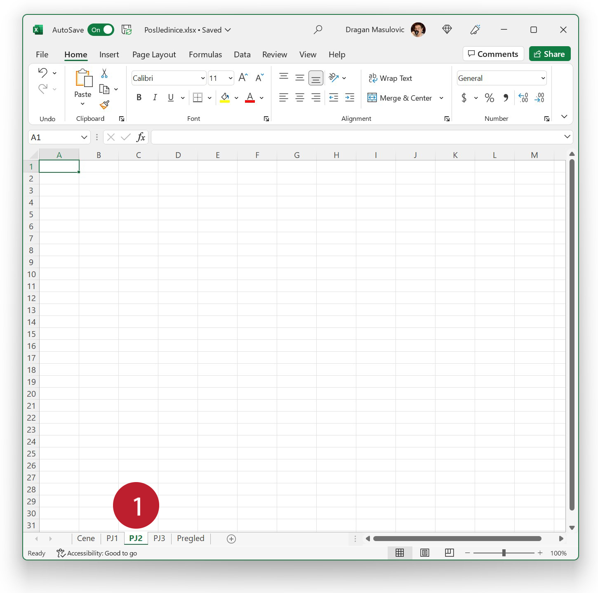
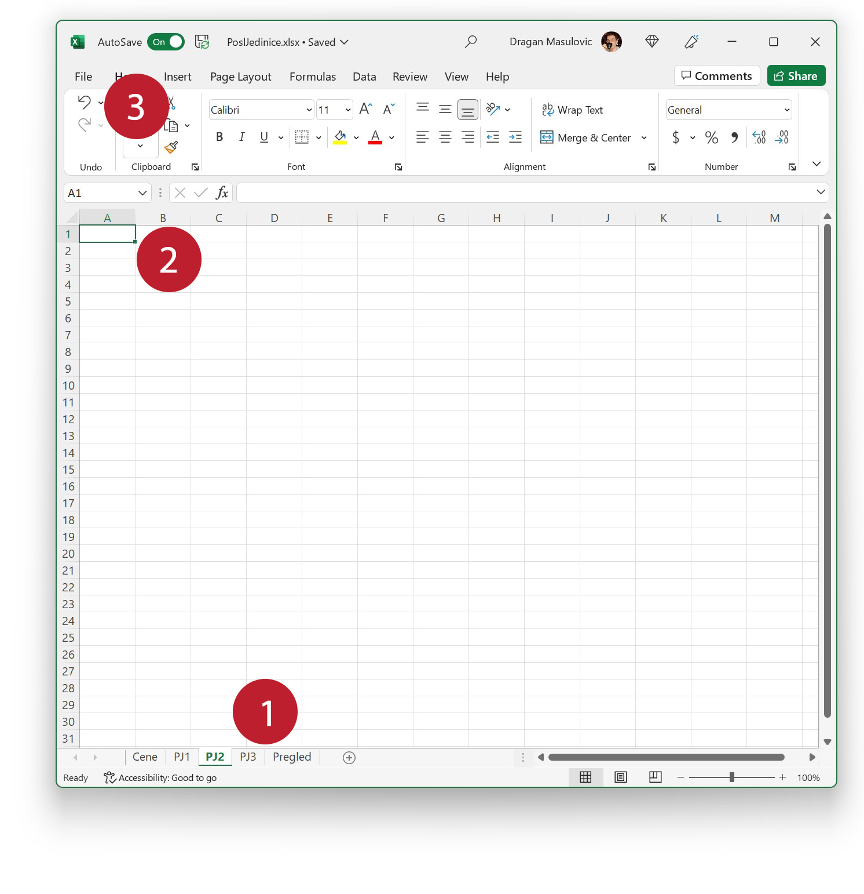
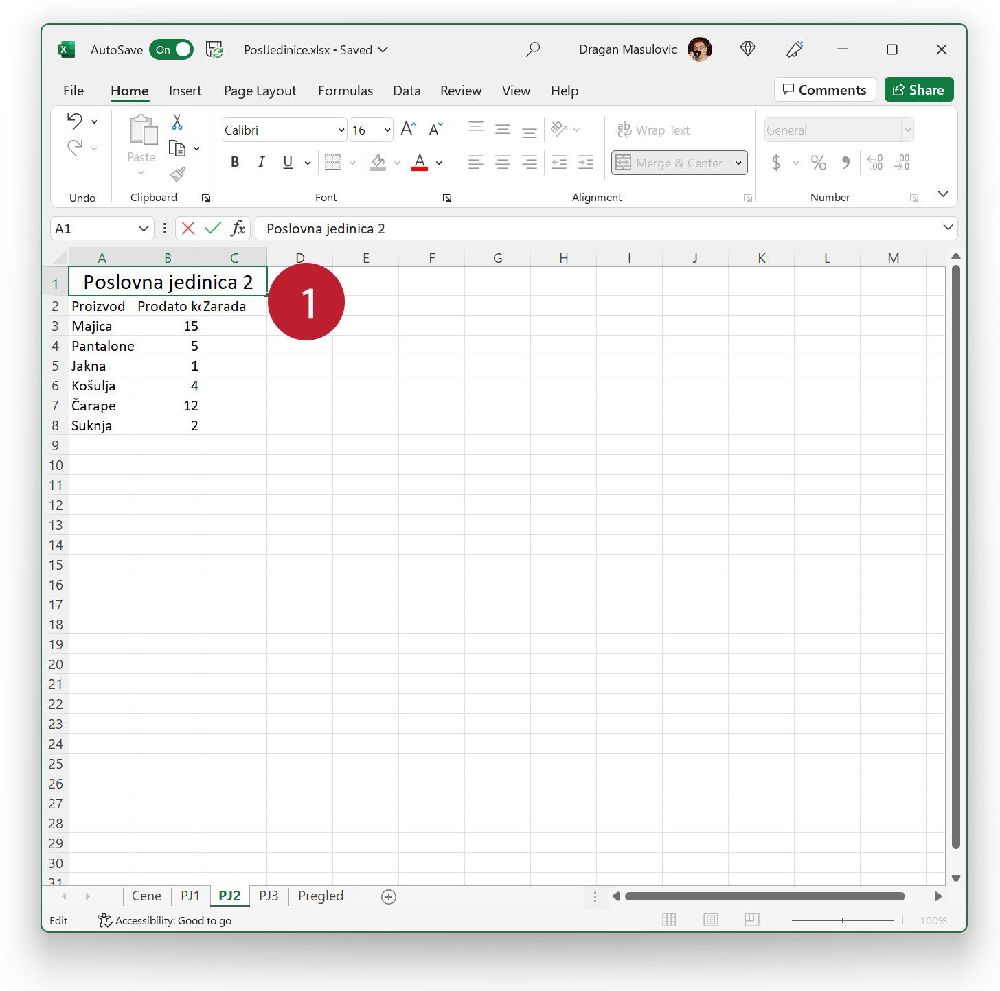

Управљање подацима на радним листовима
===============================================

Погледајмо сада како можемо да унесемо податке у радне листове и како можемо да копирамо садржај са једног радног листа на други.

Корак 5.
-----------------

Врати се на радни лист „Cene“ да га мало улепшаш:

- мало прошири колону А,
- спој ћелије A1 и B1 (опција „Merge Cells“) и повећај величину слова на 16, и
- унеси произвољне цене производа:

Корак 6.
-----------------

Пређи на радни лист „PJ1“ да њега мало улепшаш:

- мало прошири колоне А, B и C
- спој ћелије A1:C1 (опција „Merge Cells“) и повећај величину слова на 16
- унеси произвољне бројеве у колону „Prodato kom.“

Корак 7.
---------------

Пређи на радни лист „PJ2“. Он је потпуно празан:

Да не бисмо испочетка прекуцавали имена колона и имена производа, ископираћемо их са радног листа „PJ1“.

Корак 8.
----------------------

Врати се на радни лист „PJ1“ и селектуј све на њему.
Онда у групи команди „Clipboard“ кликни на опцију „Copy“.
У табели се не види никаква промена (јер ништа нисмо ни мењали); опција „Copy“ је у посебан део меморије (*Clipboard*)
прекопирала садржај ћелија A1:C8.

Корак 9.
--------------------

Сада се врати на радни лист „PJ2“ и кликни на ћелију А1
па из групе команди „Clipboard“ одабери опцију „Paste“:

Ексел је ископирао податке из меморије на нову локацију тако да горњи десни угао нове табеле буде ћелија на коју смо кликнули на почетку (А1):

Корак 10.
------------------------

Кликни на наслов табеле (ћелије А1:C1) и притисни тастер [F2] како би прешао у мод за исправке.
Исправи „Poslovna jedinica 1“ на „Poslovna jedinica 2“ и притисни [ENTER]:

Корак 11.
---------------

Селектуј ћелије B3:B8 и притисни тастер [Del] како бисмо обрисали податке:

.. image:: ../../_images/PJ37.jpg
   :width: 600px
   :align: center

Корак 12.
--------------------------

За крај рада на радном листу „PJ2“:

- мало прошири колоне А, B и C
- унеси произвољне бројеве у колону „Prodato kom.“

.. image:: ../../_images/PJ21.jpg
   :width: 600px
   :align: center

Корак 13.
---------------------------

На исти начин попуни радни лист „PJ3“:

Корак 14.
-------------------

Радни лист „Pregled“ има другачију структуру јер је на њему сажет преглед зарада по пословним јединицама. Попуни га овако:

.. image:: ../../_images/PJ40.jpg
   :width: 600px
   :align: center

