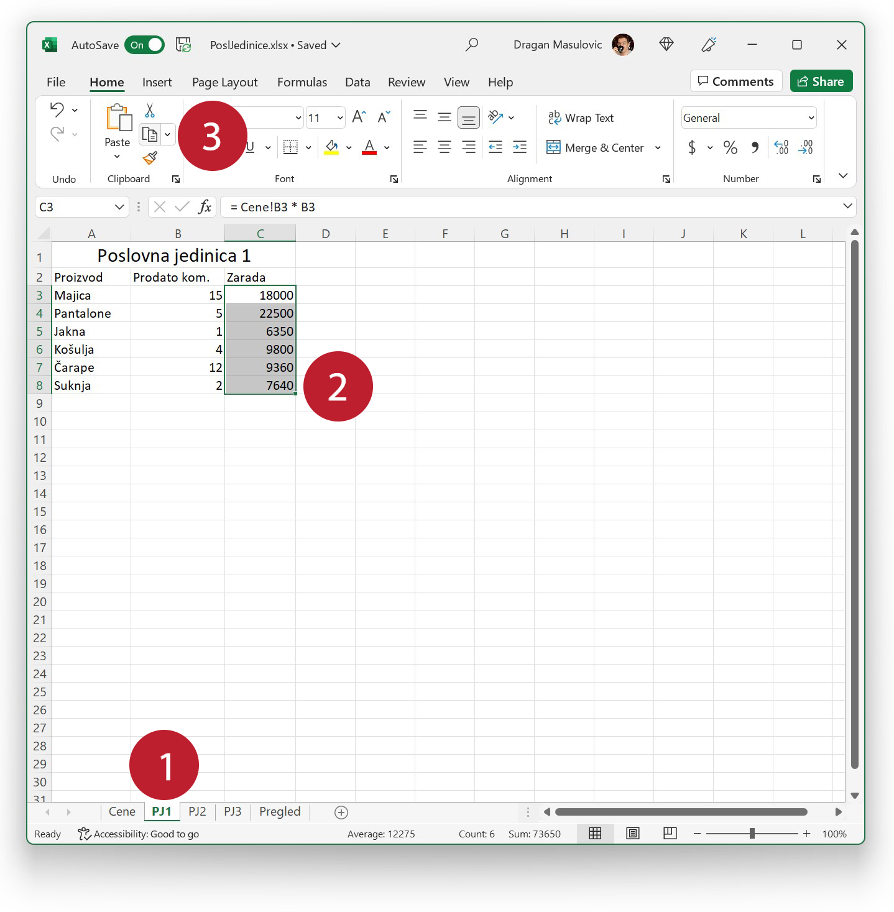
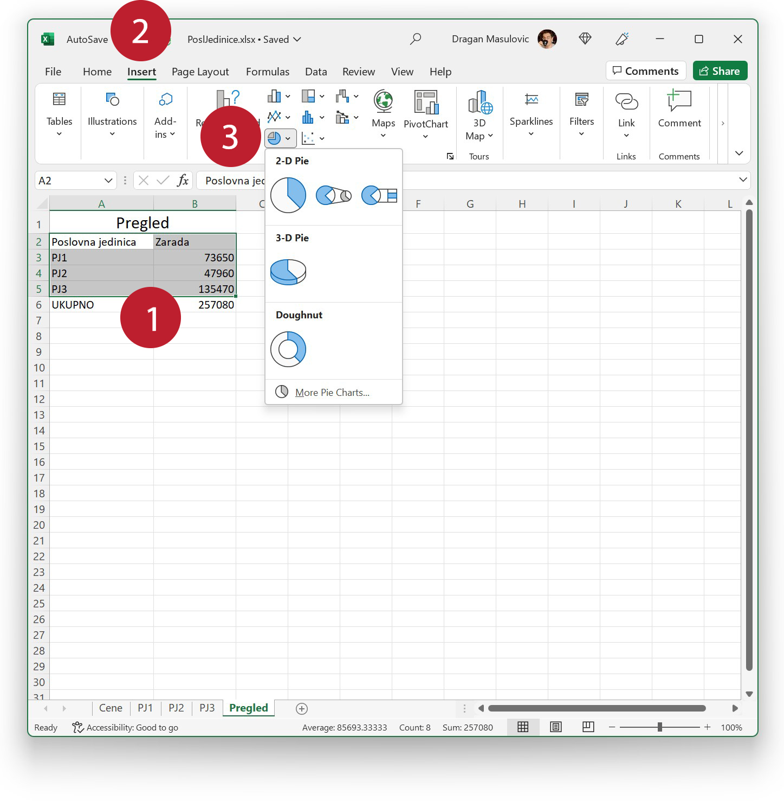
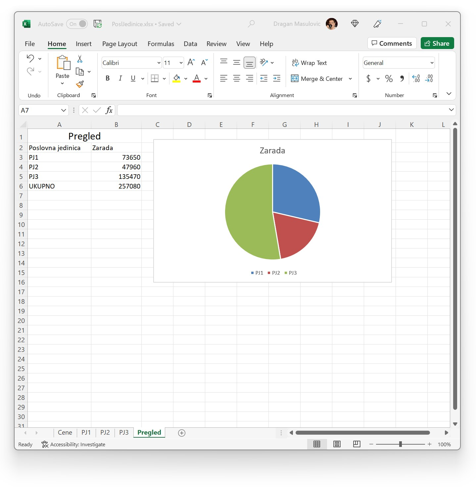

Преузимање података са другог радног листа
================================================

Сада ћемо, на основу података које смо унели у табелу, израчунати колико је зарадила свака од пословница. Да се подсетимо, радни лист „Cene“ представља ценовник, на њему не треба ништа рачунати.

Корак 15.
-----------------------------

Пређимо на радни лист „PJ1“ како бисмо израчунали колико је Пословна јединица 1 зарадила. У ћелији C3

.. image:: ../../_images/PJ41.jpg
   :width: 600px
   :align: center

треба да израчунамо колико је новца зарађено продајом мајица у тој пословној јединици. Податак о броју продатих мајица је дат на радном листу „PJ1“, док је цена једне мајице дата на радном листу „Cene“. У ћелију C3 треба да унесемо формулу:
::

    = (цена мајице са радног листа „Cene“) * B3

Податак о цени једне мајице се налази на радном листу „Cene“ у ћелији B3. До тог податка можемо доћи помоћу израза

.. infonote::

    ``Cene!B3`` што значи: *ћелија B3 са радног листа „Cene“*.
    
Дакле, у ћелију C3 треба да унесемо формулу:
::

    = Cene!B3 * B3

Корак 16.
-------------------

Пошто у ћелије испод ћелије C3 треба да унесемо сличне формуле, кликнућемо на ћелију C3 и „развући“ је до краја табеле:

Ексел је, као и до сада, интелигентно ископирао формуле, што можемо лако проверити:

Корак 17.
-----------------

Зараду Пословних јединица 2 и 3 ћемо још брже израчунати. На радном листу „PJ1“ ћемо селектовати ћелије C3:C8
па ћемо кликнути на опцију „Copy“:

Онда ћемо прећи на радни лист „PJ2“, кликнути на ћелију C3 и одабрати опцију „Paste“:

.. image:: ../../_images/PJ48.jpg
   :width: 600px
   :align: center

па ћемо поступак поновити за радни лист „PJ3“.
Лако се можемо уверити да је Ексел у сваком од ових случајева ископирао формуле тачно онако како смо и очекивали.

Корак 18.
------------------

Сада ћемо попунити радни лист „Pregled“ на коме се налази преглед укупне зараде.

У ћелију B3 радног листа „Pregled“ треба да упишемо зараду Пословне јединице 1, што је збир ћелија C3:C8 са радног листа „PJ1“. Зато ћемо у ћелију B3 унети следећу формулу:
::

    =SUM(PJ1!C3:C8)

.. infonote::

    Израз ``PJ1!C3:C8`` значи: „са радног листа PJ1 опсег C3:C8“.
    Зато израз ``SUM(PJ1!C3:C8)`` значи: „са радног листа PJ1 опсег C3:C8, па сума свега тога“.

Корак 19.
-----------------------------------------

На исти начин попунимо ћелије B4 и B5 које садрже зараду Пословних јединица 2 и 3 тако што, редом, унесемо формуле
::

    =SUM(PJ2!C3:C8)
    =SUM(PJ3!C3:C8)

.. questionnote::

    Пажња! Овде не смемо да „развучемо формулу“ из ћелије B3 већ треба ручно да унесемо још две формуле! Шта мислиш зашто?

Да бисмо завршили рачун на овом радном листу, у ћелију B6 ћемо унети укупну зараду из све три пословне јединице:

Корак 20.
---------------------

За крај ћемо секторским дијаграмом приказати удео сваке од ове три пословне јединице у укупној заради фирме.

Селектоваћемо ћелије A2:B5 (*имена колона обавезно укључујемо у селекцију!*), прећи на командну траку „Insert“ и из групе команди „Charts“ одабрати опцију која креира секторске дијаграме:

Добијамо дијаграм:

Са овог дијаграма се лако види да је у ситуацији која је описана овом табелом Пословна јединица 3 зарадила више него Пословне јединице 1 и 2 заједно.

