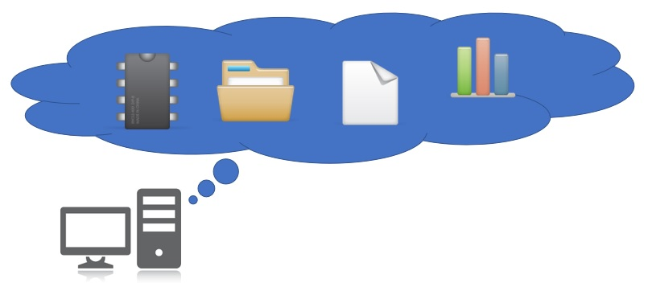
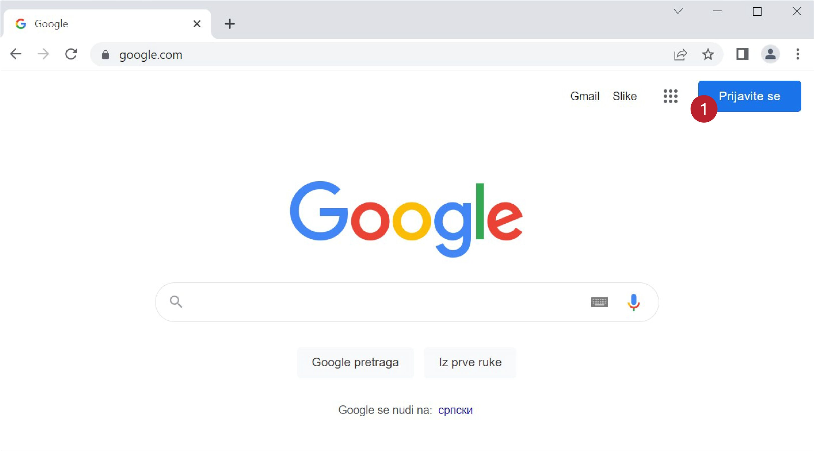
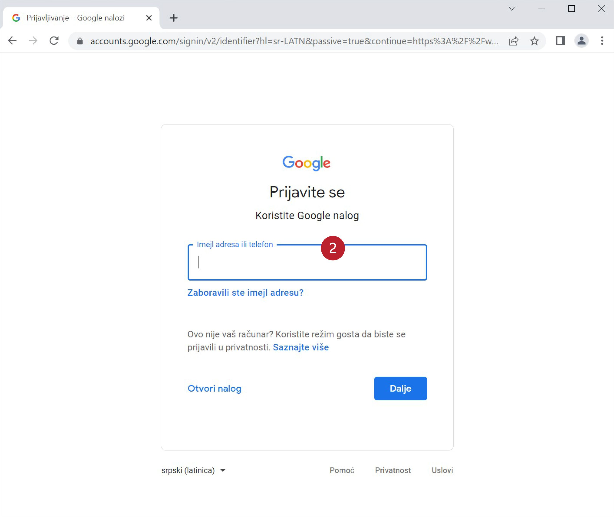

Сервиси „у облаку“ (cloud services)
=====================================

Огромна брзина протока информација кроз Интернет је омогућила брз и једноставан приступ удаљеним подацима, а потом и развој
*сервиса „у облаку“* (*cloud services*). Сервис „у облаку“ је програм који се извршава на удаљеном рачунару и кога
користимо преко Интернета. Типичан пример сервиса „у облаку“ који користимо скоро сваки дан је *веб-мејл*
(*web mail*), што представља систем за слање и примање електронске поште где се и програм преко којег шаљемо и примамо електронску пошту, као и подаци (електронска писма) налазе на удаљеном рачунару чији је задатак да опслужује кориснике веб-сервиса. Зато се такви удаљени рачунари називају *сервери*.

Данас на располагању имамо на хиљаде разних сервиса „у облаку“, који се крећу од обичног чувања докумената,
преко могућности да групе корисника сарађују на обради докумената „у облаку“, па чак до изнајмљивања процесорског времена.

На пример, компанија Гугл (Google) за своје кориснике нуди:

* Google Mail - електонску пошту „у облаку“,
* Google Drive - сервис за складиштење докумената „у облаку“,
* Google Docs, Sheets, Slides - сервис за креирање и уређивање текстова, табела и презентација „у облаку“.

Слично томе, компанија Мајкрософт (Microsoft) за своје кориснике нуди:

* Outlook - електонску пошту „у облаку“,
* OneDrive - сервис за складиштење докумената „у облаку“,
* Word, Excel, PowerPoint - сервис за креирање и уређивање текстова, табела и презентација „у облаку“,
* Azure - сервис за извршавање апликација (програма) „у облаку“.

Наравно, Гугл и Мајкрософт нису једине компаније које нуде сервисе „у облаку“.

Циљ ове лекције је да покажемо како се користе сервиси „у облаку“ за рад са табелама за унакрсна израчунавања, са освртом на могућност да више корисника у
исто време ради на једном документу (*колаборација*). Определили смо се за Гуглове сервисе зато што су бесплатни и зато што верујемо да већина ученика
у Србији већ поседује кориснички налог код Гугла због популарности паметних телефона базираних на Андроиду.
Гуглове сервисе могу да користе само регистровани корисници.
Да бисмо приступили сервисима, треба прво да се пријавимо.
Треба отићи на *google.com*, кликнути на „Пријави се“ (или „Sign In“):

и потом унети своју адресу за електронску пошту и одговарајућу лозинку:

Након идентификације имамо приступ свим Гугловим сервисима.

У овој лекцији
----------------

У овој лекцији се бавимо подацима „у облаку”. Причаћемо о:

1. сервисима „у облаку”,
2. креирању документа „у облаку”,
3. дељењу документа „у облаку” са сарадницима, и
4. преузимању документа.
