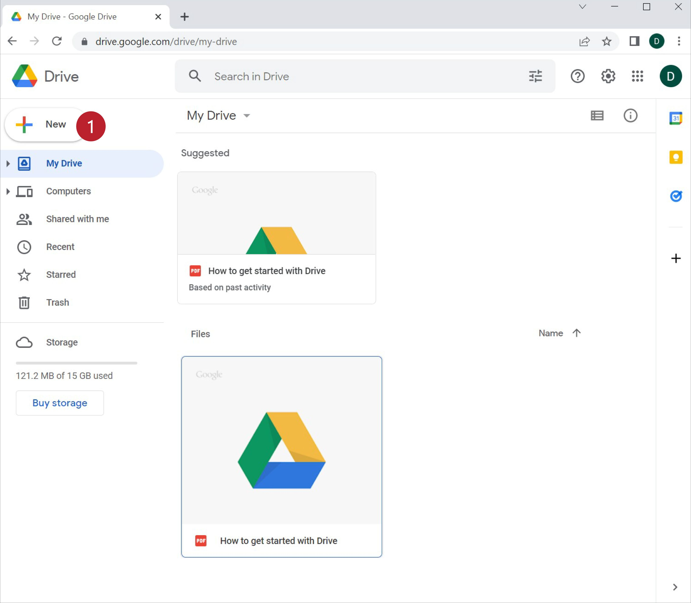
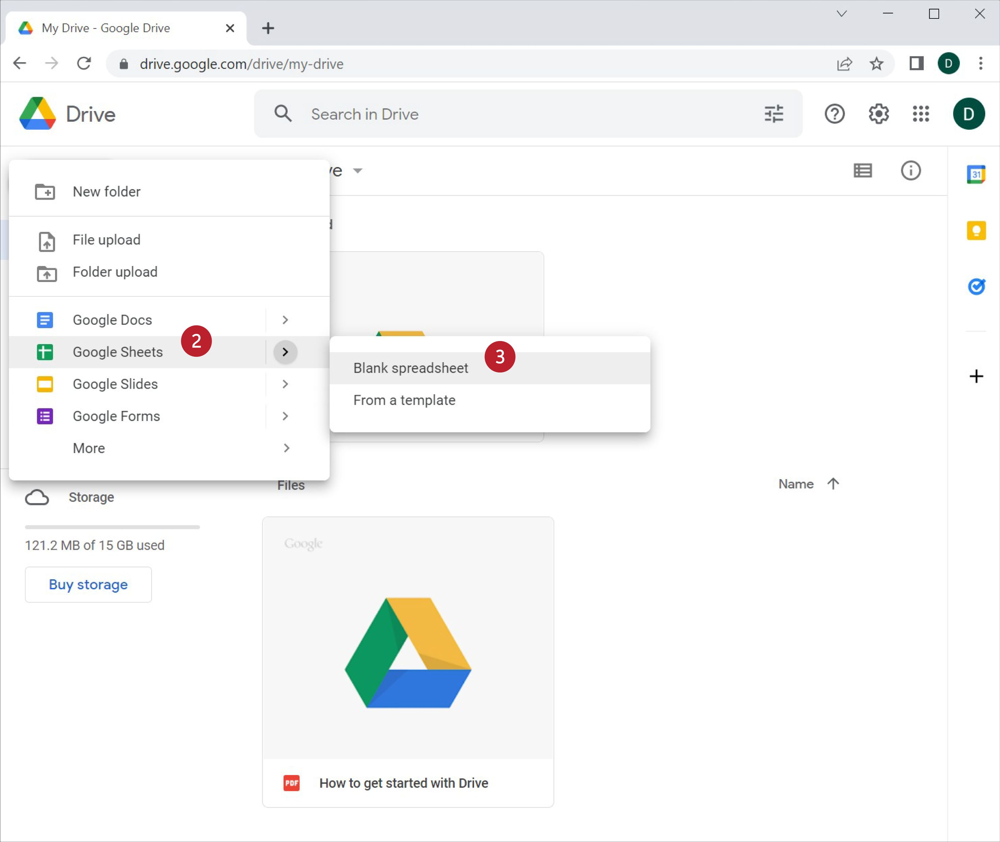
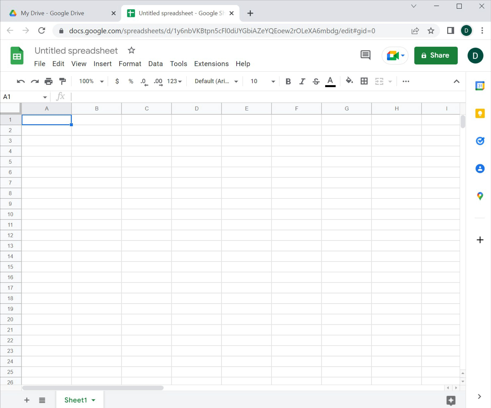
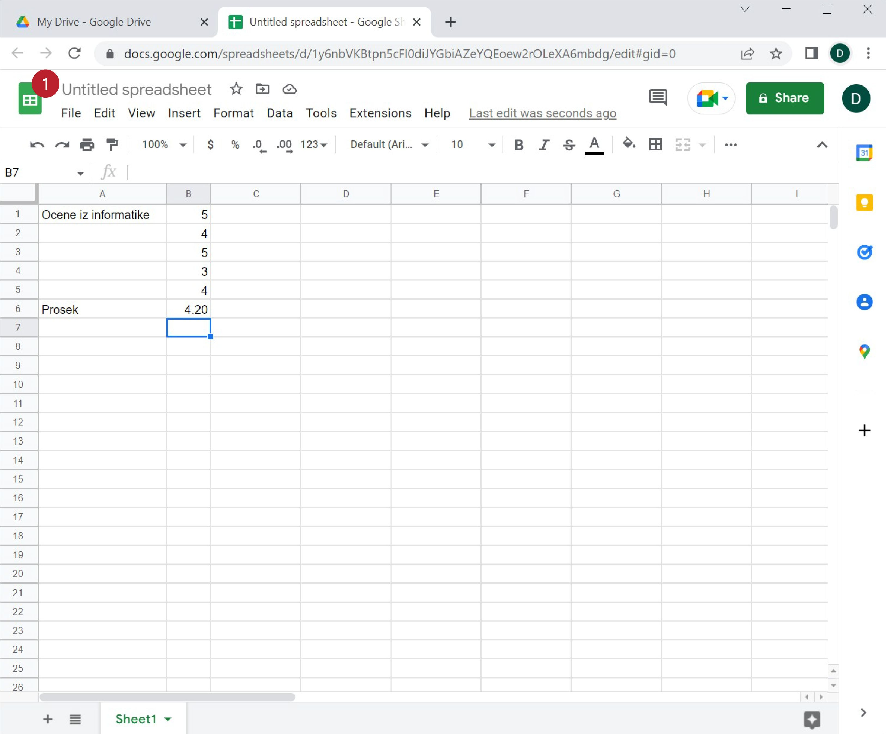
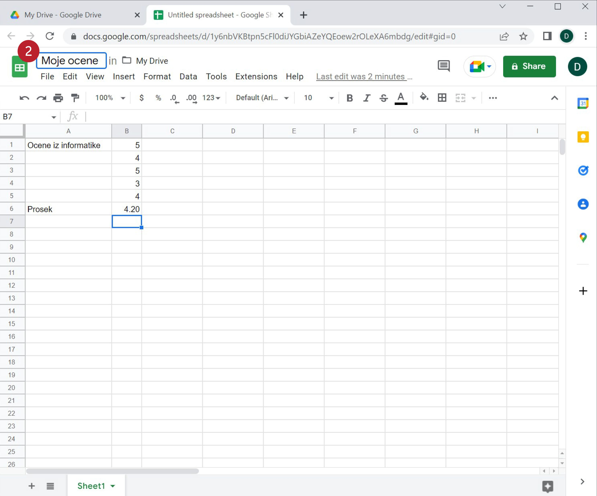
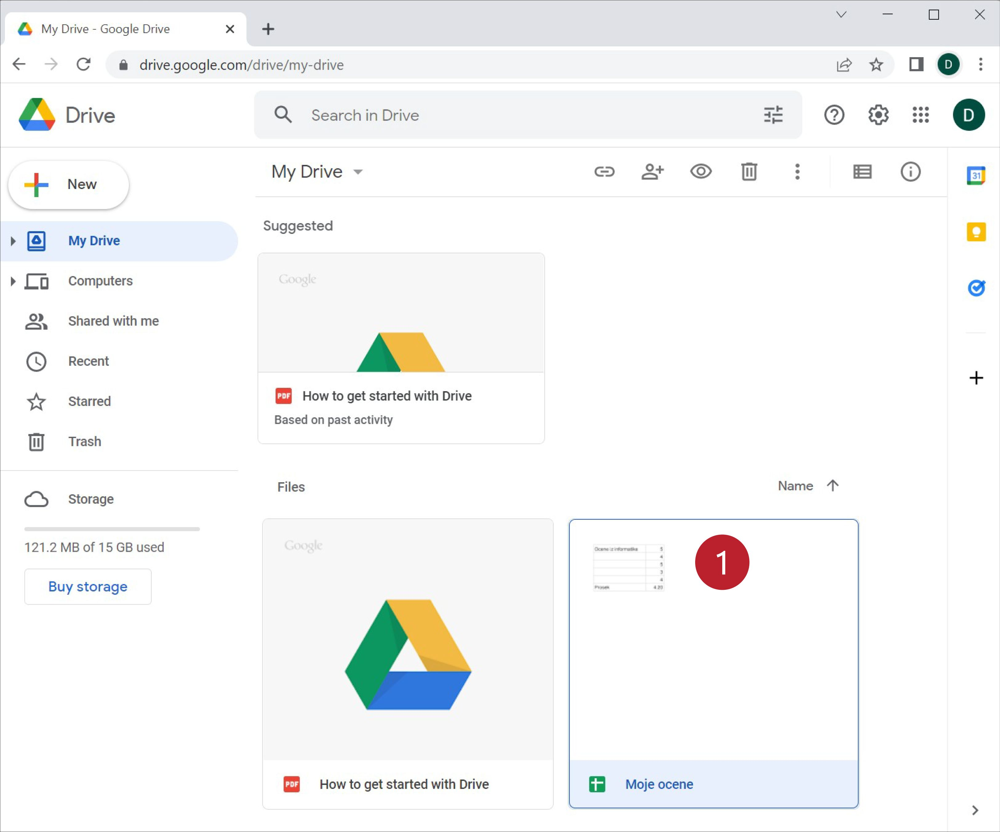

Креирање документа „у облаку“
====================================

Са документима „у облаку“ обично радимо тако што помоћу неког веб-прегледача
приступимо сервису и онда управљамо подацима кроз веб-прегледач.
Ми ћемо у овом курсу користити *drive.google.com*, 
што је комбиновани сервис за смештање података „у облак“, као и за креирање нових докумената „у облаку“. 

Нови документ се креира кликом на „New“ (1):

након чега имамо могућност да одаберемо врсту документа коју желимо да креирамо.
Ми ћемо се определити за „Google Sheets“ (2), па „Blank spreadsheet“ (3):

што је празна табела за унакрсна израчунавања:

Организација радне површине веома личи на Ексел и већина елемената би требало да ти је разумљива.
Да бисмо се привикли на ново окружење урадићемо једну кратку вежбу.

Корак 2.
-----------------

У празан документ унеси своје оцене из информатике (стварне или измишљене) и израчунај њихов
просек користећи функцију AVERAGE као што смо вежбали. Табела треба да изгледа отприлике овако:

.. figure:: ../../_images/Sh7-1.jpg
   :width: 780px
   :align: center
   :class: screenshot-shadow

Корак 3.
---------------

Табела се тренутно зове „Untitled spreadsheet“. Преименоваћемо је у „Moje ocene“.
Кликни на име табеле „Untitled spreadsheet“:

па у оквир који се појавио унеси „Moje ocene“ *без наводника* и притисни [ENTER]:

.. infonote::

   При раду са документима „у облаку“ *нема опције „Save“* која снима документ.
   Свака измена у документу се одмах прослеђује серверу.

Када завршимо рад на табели довољно је само да затворимо таб у прегледачу.
Нови документ са именом „Moje ocene“ се појавио на списку докумената који су ускладиштени:

