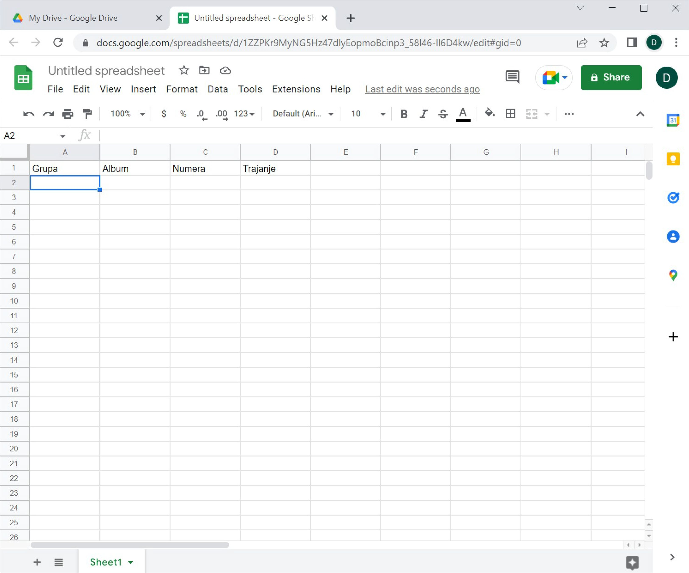
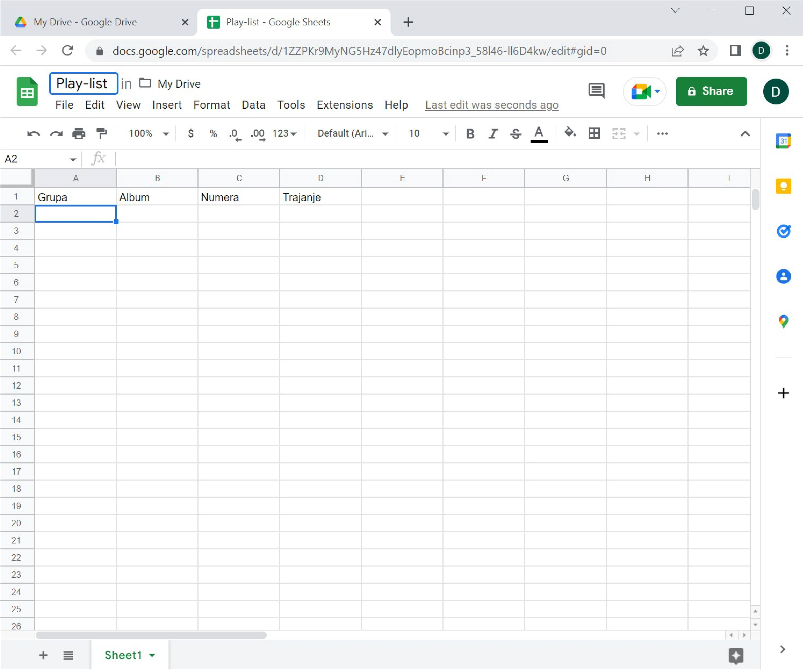
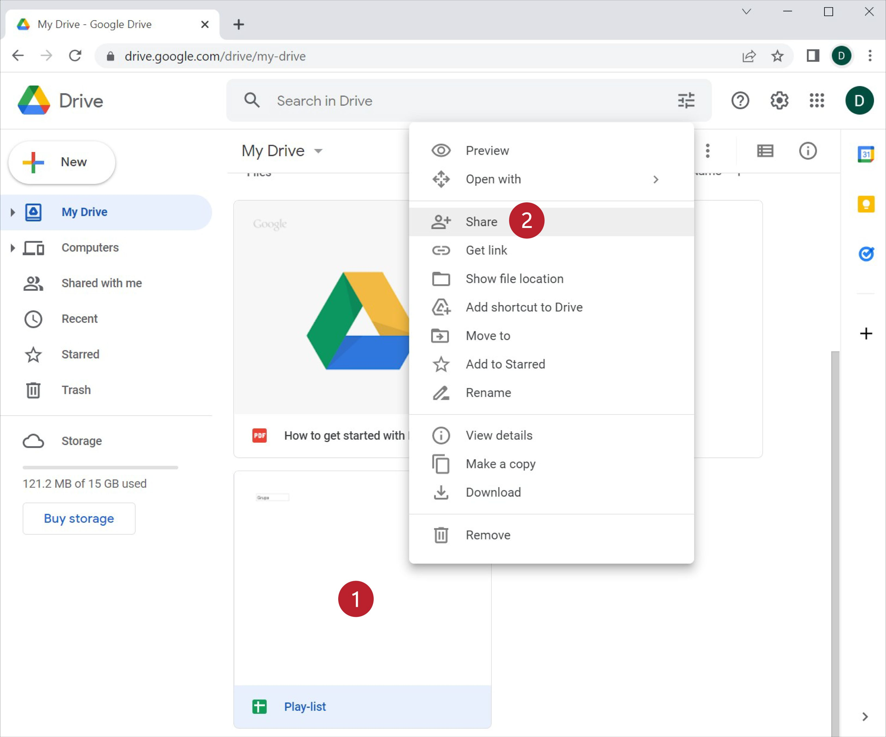
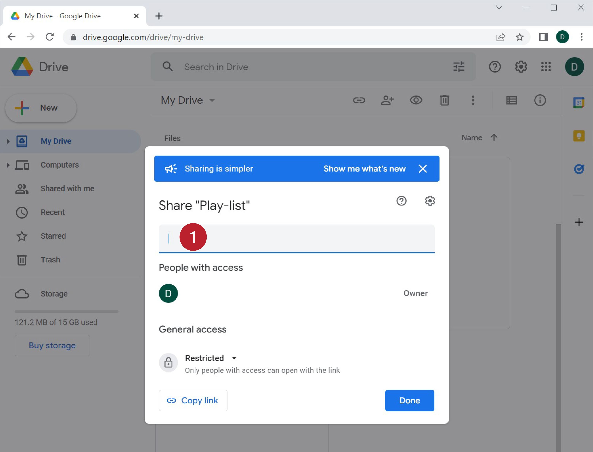
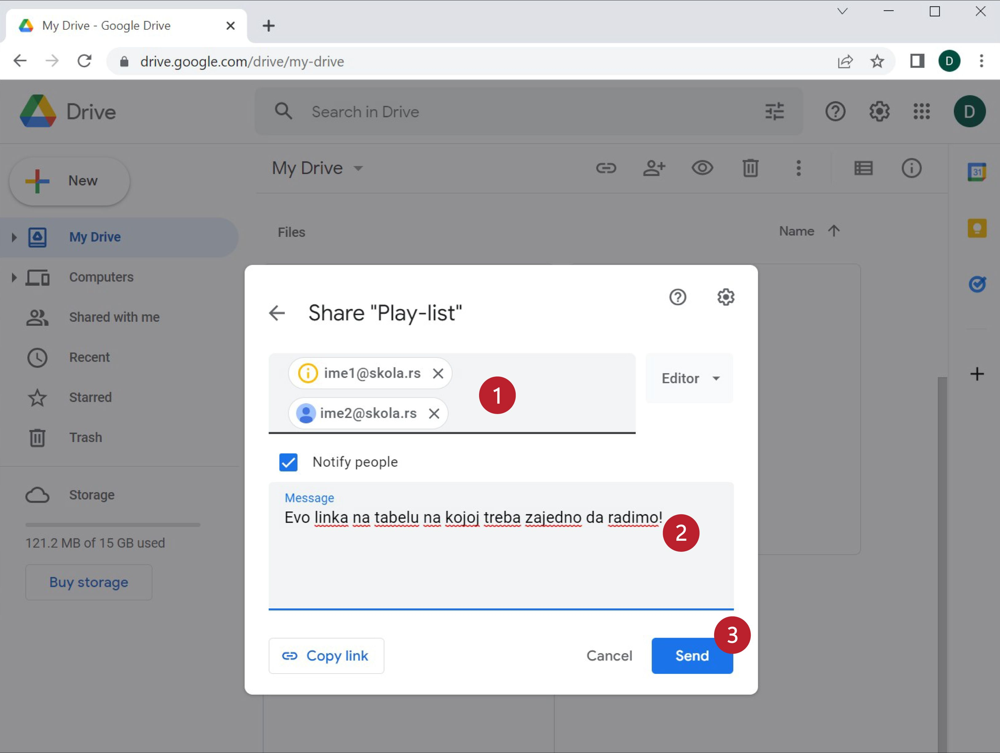
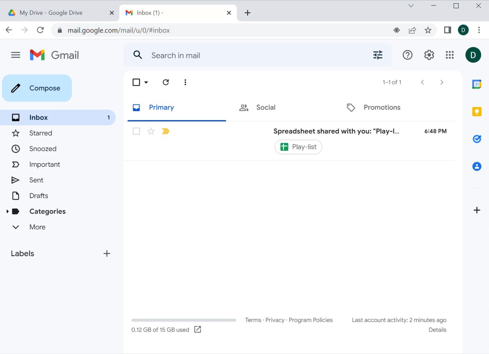
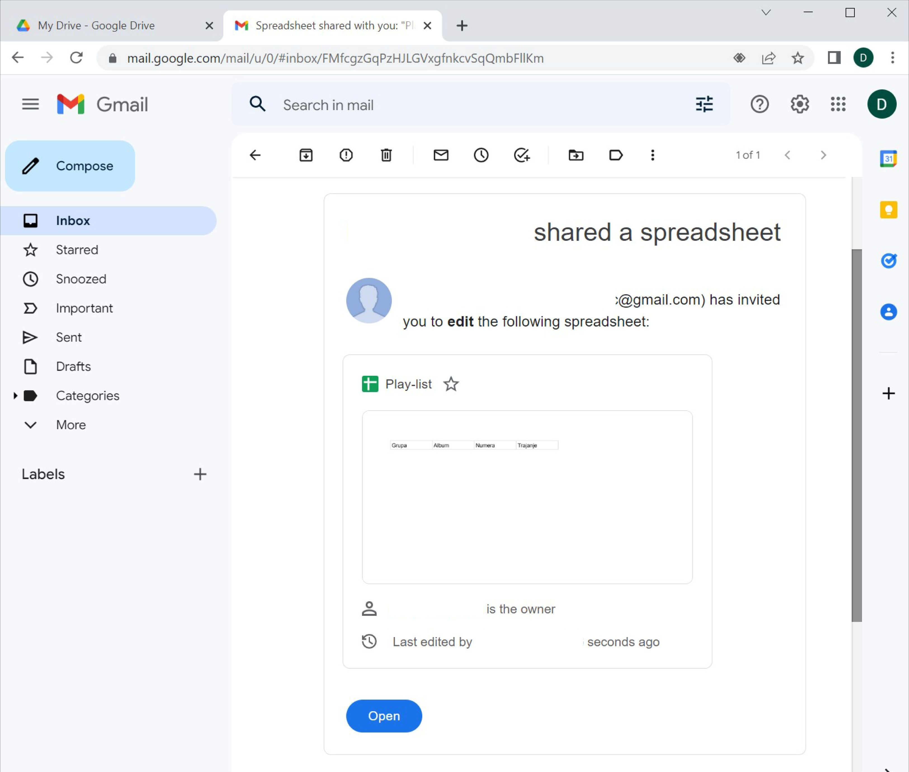
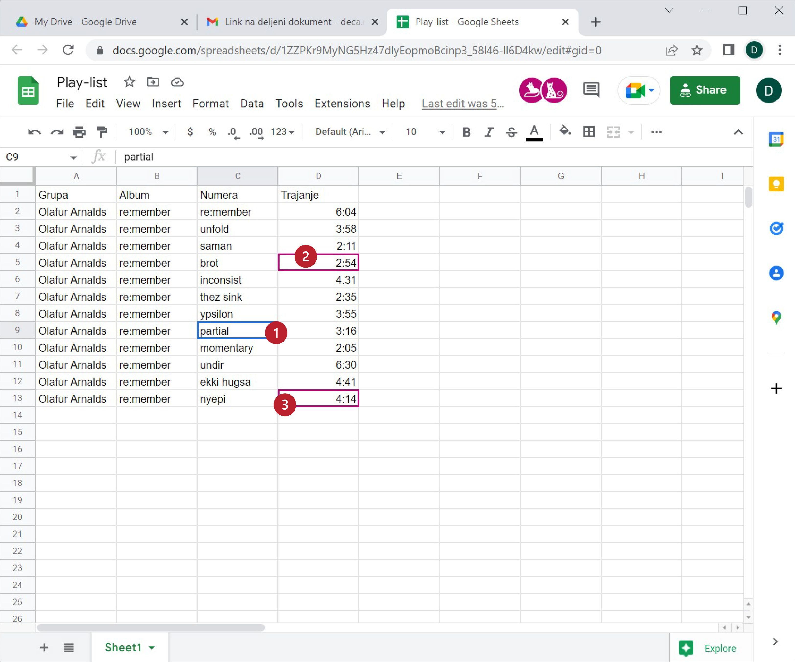

Дељење документа „у облаку“ и сарадња
===========================================

Сервиси у облаку ти нуде могућност да својим документима приступиш са било ког уређаја,
са било које тачке на планети (која има приступ интернету), као и да поделиш своје документе
са другима тако да можете да радите заједно на истом документу!

Као пример сарадње направићемо плеј-листу која има следеће колоне:

* Grupa
* Album
* Numera
* Trajanje

До сада већ свако зна да унесе податке у табелу, па би просто пуњење табеле подацима било бескрајно досадно.
Да бисмо ствари учинили интересантнијим показаћемо како више корисника може да ради на истом документу.

Корак 1.
-----------------

Поделите се у мање групе. Нека *један од чланова групе* направи овакву табелу:

и нека је преименује је у „Play-list“:

.. Ево и кратког видеа:

    .. ytpopup:: VJCjI3EJxqM
       :width: 735
       :height: 415
       :align: center

Корак 2.
--------------

Сада ћемо поделити документ са другим корисницима. Кликни *десним* тастером миша на документ (1)
и из менија који се појавио одабери „Share“ (2):

Појавиће дијалог помоћу кога ћемо поделити документ са друговима.
У правоугаоник (1) унеси имејл адресе другова са којима ће табела бити подељена.

Чим унесеш прву адресу дијалог ће се трансформисати у:

Ту можеш унети и остале адресе (1) и поздравну поруку (2). Након тога кликни на „Send“ (3).

.. Ево и кратког видеа:
   
   .. ytpopup:: f55A9KYwUnI
      :width: 735
      :height: 415
      :align: center

   
Корак 3.
-------------------

Сви чланови групе ће добити обавештење путем електронске поште да је документ подељен са њима:

Да би прихватили позив треба да отворе поруку и кликну на „Open“:

Сачувај поруку са обавештењем да је документ подељен са тобом јер у сваком тренутку можеш
доћи до документа тако што ћеш отворити поруку и кликнути на „Open“.

Док више корисника ради на истом документу, свако има своју активну ћелију и тако се може пратити колико људи ради на документу и шта ко ради:

.. Ево и кратког видеа:

   .. ytpopup:: dlgDeyxmFQQ
      :width: 735
      :height: 415
      :align: center
